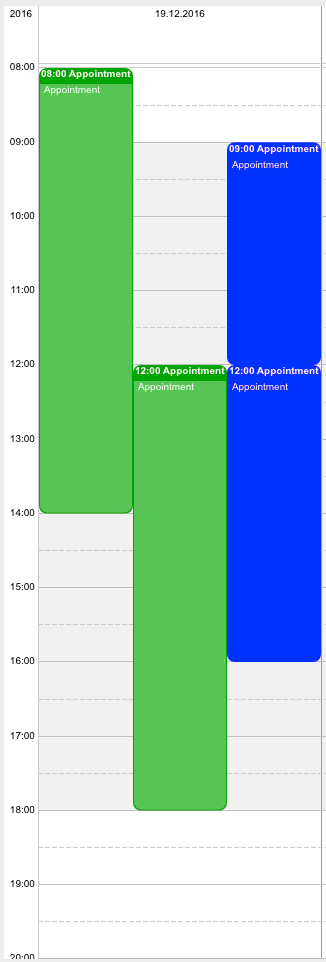
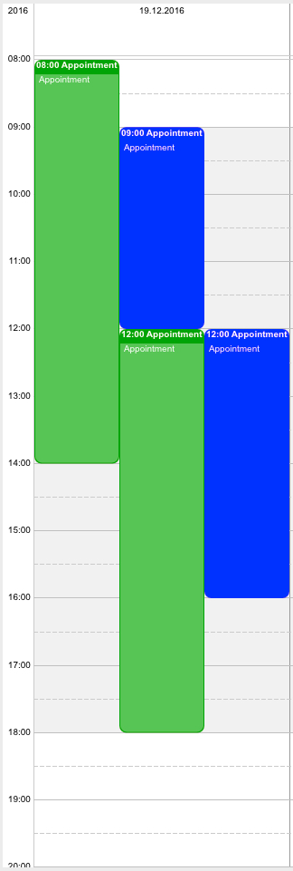

[Appointments](../../guides/category-pages/appointments.md)

# hmCal_Add Group

`hmCal_Add Group(area;appointments) -> reference`

```4d
Parameter          Type             Description
area               Longint      ->  hmCal area
appointments       ARRAY LONGINT->  appointment list
reference          Longint      <-  group reference
```

<a id="nummer_00001"></a>

## Description

The command ***hmCal_Add Group*** groups appointments together. This is helpful, if you want to display appointments together with other regarding appointments. Grouped appointments will be always shown in **one** row, regardless if they may overlap or not.

You have to pass appointment references of existing appointments. Otherwise the result is *0* and the callback throws an error -2.

The result is the reference of the created group.

If you want to shift other connected appointments automatically, use [hmCal_SET GROUP PROPERTY](hmCal_SET-GROUP-PROPERTY.md) to activate it.

<a id="nummer_00002"></a>

## Example

The following example creates a group out of two appointments:

```4d
ARRAY LONGINT($tl_group;2)		
$tl_group{1}:=1
$tl_group{2}:=2

$vl_group:=hmCal_Add Group ($vl_area;$tl_group)
```





Left: grouped, right: ungrouped (default)
