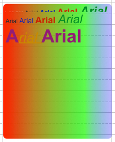

[Appointments](../../guides/category-pages/appointments.md)

# hmCal_SET APP GRADIENT

`hmCal_SET APP GRADIENT(area;reference;ArrayOffset;ArrayRed;ArrayGreen;ArrayBlue;ArrayAlpha)`

```
Parameter          Type             Description
area               Longint      ->  hmCal area
reference          Longint      ->  appointment reference
ArrayOffset        Real-Array   ->  Array with offsets
ArrayRed           Longint-Array->  Array with red color component
ArrayGreen         Longint-Array->  Array with green color component
ArrayBlue          Longint-Array->  Array with blue color component
ArrayAlpha         Real-Array   ->  Array with alpha channel
```

<a id="nummer_00001"></a>

## Description

The command ***hmCal_SET APP GRADIENT*** sets a custom gradient for an appointment. You have to pass 5 arrays with the same size into this command. The array *ArrayOffset* represents the positions of each color from 0 to 1. 0 represents the left position of the appointment, 1 is the right position. In the arrays *ArrayRed*, *ArrayGreen* and *ArrayBlue* you have to pass the color as 16 bit components. The array *ArrayAlpha* is the alpha channel of the color from 0 (=transparent) to 1 (=opaque).

The gradient is always from the left to the right border of the appointment.

To activate the gradient, the property *hmCal_aprop_UseGradient* must be set with the command [hmCal_Set App Property](hmCal_Set-App-Property.md). Also the effect *hmCal_aprop_Effect* must be set to *hmCal_Effect_Fading*.

<a id="nummer_00002"></a>

## Example

The following example sets the gradient with 3 colors (red, green, blue) for an appointment with the ID=1:

```4d
C_LONGINT($vl_error;$vl_area)

$vl_error:=hmCal_Set App Property ($vl_area;1;hmCal_aprop_UseGradient;1;"";!00.00.00!)
$vl_error:=hmCal_Set App Property ($vl_area;1;hmCal_aprop_Effect;2;"";!00.00.00!)

ARRAY REAL($tz_offsets;3)
ARRAY LONGINT($tl_red;3)
ARRAY LONGINT($tl_green;3)
ARRAY LONGINT($tl_blue;3)
ARRAY REAL($tz_alpha;3)

$tz_offsets{1}:=0
$tl_red{1}:=0xFFFF
$tl_green{1}:=0
$tl_blue{1}:=0
$tz_alpha{1}:=1

$tz_offsets{2}:=0,75
$tl_red{2}:=0
$tl_green{2}:=0xFFFF
$tl_blue{2}:=0
$tz_alpha{2}:=0,7

$tz_offsets{3}:=1
$tl_red{3}:=0
$tl_green{3}:=0
$tl_blue{3}:=0xFFFF
$tz_alpha{3}:=0,3

hmCal_SET APP GRADIENT ($vl_area;1;$tz_offsets;$tl_red;$tl_green;$tl_blue;$tz_alpha)
```

Result is:


