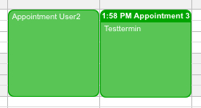
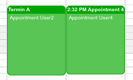
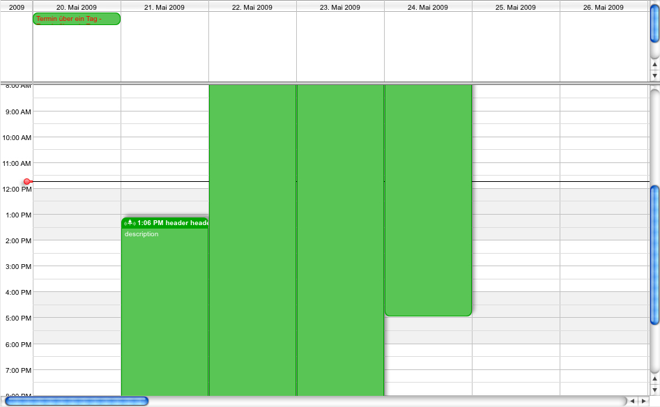
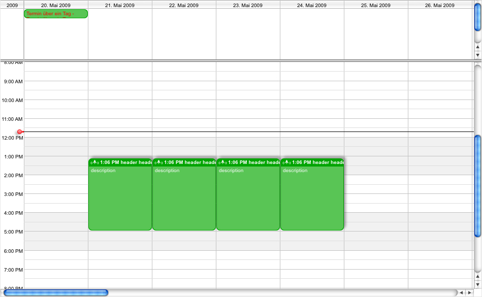
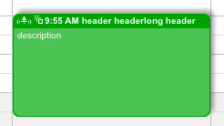
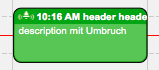

[Appointments](../../guides/category-pages/appointments.md)

# hmCal_Set App Property

`hmCal_Set App Property(area;reference;property;num;text;date) -> error`

| Parameter | Type | Direction | Description |
| --- | --- | --- | --- |
| area | Longint | -> | hmCal area |
| reference | Longint | -> | appointment reference |
| property | Longint | -> | property to set |
| num | Real | -> | numeric value to set |
| text | Text | -> | text value to set |
| date | Datum | -> | date value to set |
| error | Longint | <- | errorcode |

## Contents

- [1 Description](#nummer_00001)
- [2 Property](#nummer_00002)  [3 Example](#nummer_00057)
  - [2.1 hmCal_aprop_ID (1)](#nummer_00003)
  - [2.2 hmCal_aprop_CalendarID (2)](#nummer_00004)
  - [2.3 hmCal_aprop_Textheader (3)](#nummer_00005)
  - [2.4 hmCal_aprop_Textbody (4)](#nummer_00006)
  - [2.5 hmCal_aprop_Tiptext (5)](#nummer_00007)
  - [2.6 hmCal_aprop_AllDay (6)](#nummer_00008)
  - [2.7 hmCal_aprop_DateFrom (7)](#nummer_00009)
  - [2.8 hmCal_aprop_DateTo (8)](#nummer_00010)
  - [2.9 hmCal_aprop_TimeFrom (9)](#nummer_00011)
  - [2.10 hmCal_aprop_TimeTo (10)](#nummer_00012)
  - [2.11 hmCal_aprop_Effect (11)](#nummer_00013)
  - [2.12 hmCal_aprop_DoneStatus (12)](#nummer_00014)
  - [2.13 hmCal_aprop_Milestone (13)](#nummer_00015)
  - [2.14 hmCal_aprop_Icon (14)](#nummer_00016)
  - [2.15 hmCal_aprop_Lock (15)](#nummer_00017)
  - [2.16 hmCal_aprop_SupAppointment (16)](#nummer_00018)
  - [2.17 hmCal_aprop_HeaderVisible (17)](#nummer_00019)
  - [2.18 hmCal_aprop_TimeVisible (18)](#nummer_00020)
  - [2.19 hmCal_aprop_ShowCurrentTime (19)](#nummer_00021)
  - [2.20 hmCal_aprop_CurrDateFrom (20)](#nummer_00022)
  - [2.21 hmCal_aprop_CurrDateTo (21)](#nummer_00023)
  - [2.22 hmCal_aprop_CurrTimeFrom (22)](#nummer_00024)
  - [2.23 hmCal_aprop_CurrTimeTo (23)](#nummer_00025)
  - [2.24 hmCal_aprop_Location (24)](#nummer_00026)
  - [2.25 hmCal_aprop_Expand (25)](#nummer_00027)
  - [2.26 hmCal_aprop_Priority (26)](#nummer_00028)
  - [2.27 hmCal_aprop_UID (27)](#nummer_00029)
  - [2.28 hmCal_aprop_URL (28)](#nummer_00030)
  - [2.29 hmCal_aprop_Independent (29)](#nummer_00031)
  - [2.30 hmCal_aprop_DrawAsRect (30)](#nummer_00032)
  - [2.31 hmCal_aprop_HasSubApps (31)](#nummer_00033)
  - [2.32 hmCal_aprop_Icon2 (32)](#nummer_00034)
  - [2.33 hmCal_aprop_Icon3 (33)](#nummer_00035)
  - [2.34 hmCal_aprop_TextheaderMS (34)](#nummer_00036)
  - [2.35 hmCal_aprop_TextbodyMS (35)](#nummer_00037)
  - [2.36 hmCal_aprop_UseGradient (36)](#nummer_00038)
  - [2.37 hmCal_aprop_Sequence (37)](#nummer_00039)
  - [2.38 hmCal_aprop_Method (38)](#nummer_00040)
  - [2.39 hmCal_aprop_Textalignment_H (39)](#nummer_00041)
  - [2.40 hmCal_aprop_ShowFrame (40)](#nummer_00042)
  - [2.41 hmCal_aprop_DTSTAMP (41)](#nummer_00043)
  - [2.42 hmCal_aprop_UserID (42)](#nummer_00044)
  - [2.43 hmCal_aprop_Group (43)](#nummer_00045)
  - [2.44 hmCal_aprop_Textalignment_V (44)](#nummer_00046)
  - [2.45 hmCal_aprop_Header_Linespacing (45)](#nummer_00047)
  - [2.46 hmCal_aprop_Header_Margin_left (46)](#nummer_00048)
  - [2.47 hmCal_aprop_Header_Margin_top (47)](#nummer_00049)
  - [2.48 hmCal_aprop_Header_Margin_right (48)](#nummer_00050)
  - [2.49 hmCal_aprop_Header_Margin_bottom (49)](#nummer_00051)
  - [2.50 hmCal_aprop_Descr_Linespacing (50)](#nummer_00052)
  - [2.51 hmCal_aprop_Descr_Margin_left (51)](#nummer_00053)
  - [2.52 hmCal_aprop_Descr_Margin_top (52)](#nummer_00054)
  - [2.53 hmCal_aprop_Descr_Margin_right (53)](#nummer_00055)
  - [2.54 hmCal_aprop_Descr_Margin_bottom (54)](#nummer_00056)

<a id="nummer_00001"></a>

## Description

With the command ***hmCal_Set App Property*** you can set several properties of an appointment. In the parameter *reference* you must pass an appointment id or just pass *0* to set the property for all appointments. You can use one of the following properties.

> Notice: You can use predefined [Constants](../../guides/appendix/Constants.md).

To get all properties you can use the command [hmCal_Get App Property](hmCal_Get-App-Property.md).

**Important: You must always set all parameters of the command. If you use not all parameters (num,text,date) you must pass an empty value.**

<a id="nummer_00002"></a>

## Property

<a id="nummer_00003"></a>

### hmCal_aprop_ID (1)

You can set a new ID for an appointment. Pass the new reference in parameter *num*.

<a id="nummer_00004"></a>

### hmCal_aprop_CalendarID (2)

With this property you can set the calendar id for an appointment. Pass the calendar id in parameter *num*.

<a id="nummer_00005"></a>

### hmCal_aprop_Textheader (3)

With this property you can set the headertext. Pass the new headertext in parameter *text*.

<a id="nummer_00006"></a>

### hmCal_aprop_Textbody (4)

With this property you can set the descriptiontext. Pass the new descriptiontext in parameter *text*.

<a id="nummer_00007"></a>

### hmCal_aprop_Tiptext (5)

With this property you can set the tiptext. Pass the new tiptextin parameter *text*.

<a id="nummer_00008"></a>

### hmCal_aprop_AllDay (6)

With this property you can set the allday flag of an appointment. Set *1* for allday and *0* for not allday in parameter *num*.

<a id="nummer_00009"></a>

### hmCal_aprop_DateFrom (7)

With this property you can set the from date. Pass the new date in the parameter *date*.

<a id="nummer_00010"></a>

### hmCal_aprop_DateTo (8)

With this property you can set the to date. Pass the new date in the parameter *date*.

<a id="nummer_00011"></a>

### hmCal_aprop_TimeFrom (9)

With this property you can set the from time. Pass the new time in seconds 0-86399) in the parameter *num*.

<a id="nummer_00012"></a>

### hmCal_aprop_TimeTo (10)

With this property you can set the to time. Pass the new time in seconds 0-86399) in the parameter *num*.

<a id="nummer_00013"></a>

### hmCal_aprop_Effect (11)

With this property you can set the effect of an appointment. Just pass the effect id in the parameter *num*. The following effects are available:

- 0 = no effect
- 1 = dim effect
- 2 = fading effect
- 3 = Lleft bar effect

You can use the predefined [Constants](../../guides/appendix/Constants.md).


hmCal_Effect_Normal (0), hmCal_Effect_Dim (1), hmCal_Effect_Fading (2), hmCal_Effect_LeftBar (3)

If you use the effect *hmCal_Effect_LeftBar*, you can also define the width of the bar. You can define the width by calling the command [hmCal_SET AREA PROPERTY](../areas/hmCal_SET-AREA-PROPERTY.md) with the selector *hmCal_prop_LeftBarWidth* and the width as value.

<a id="nummer_00014"></a>

### hmCal_aprop_DoneStatus (12)

With this property you can set the done status of an appointment. You must set a value between 0 and 100 in the parameter *num*. This property is only valid for the project view.

<a id="nummer_00015"></a>

### hmCal_aprop_Milestone (13)

With this property you can define, if the appointment is an milestone or not. Pass *1* for milestone and *0* for not milestone in the parameter *num*. This property is only valid for the project view.

<a id="nummer_00016"></a>

### hmCal_aprop_Icon (14)

With this property you can set the icon id of an icon you have already created with the command [hmCal_Add Icon](../icons/hmCal_Add-Icon.md). You pass the icon id in the parameter *num*.

Pass a *0* as icon id, no icon is set.

Pass a *-1* as icon id, the standard reminder icon is used.

Pass a *-2* as icon id, the standard recurrence icon is used.

Pass a *-3* as icon id, a checked-icon is used.

Pass a *-4* as icon id, a "no-access"-icon is used.

<a id="nummer_00017"></a>

### hmCal_aprop_Lock (15)

The property defines if an appointment is locked or not. Pass *1* for locked and *0* for unlocked in the parameter *num*. Locked appointments cannot by drag and drop from the user.

<a id="nummer_00018"></a>

### hmCal_aprop_SupAppointment (16)

The property defines the superior appointment. Pass the superior appointment id in the parameter *num*.

Hierarchical appointments are only visible in the project view.

<a id="nummer_00019"></a>

### hmCal_aprop_HeaderVisible (17)

The property defines if the appointment header is visible or not. Pass *1* for visible and *0* for invisible in the parameter *num*.



Left: invisible header, right: visible header.

<a id="nummer_00020"></a>

### hmCal_aprop_TimeVisible (18)

The property defines if the time in the appointment header is visible or not. Pass *1* for visible and *0* for invisible in the parameter *num*.



Left: invisible time in header, right: visible time in header.

<a id="nummer_00021"></a>

### hmCal_aprop_ShowCurrentTime (19)

This property actives a second bar under the regular appointment bar in the project view. You must set the time range with the selectors 20,21,22 and 23.

Example:


<a id="nummer_00022"></a>

### hmCal_aprop_CurrDateFrom (20)

With this property you can set the current from date. Pass the new date in the parameter *date*. This property is only valid in the project view and in combination with the selector 19.

<a id="nummer_00023"></a>

### hmCal_aprop_CurrDateTo (21)

With this property you can set the current to date. Pass the new date in the parameter *date*. This property is only valid in the project view and in combination with the selector 19.

<a id="nummer_00024"></a>

### hmCal_aprop_CurrTimeFrom (22)

With this property you can set the current from time. Pass the new time in seconds 0-86399) in the parameter *num*. This property is only valid in the project view and in combination with the selector 19.

<a id="nummer_00025"></a>

### hmCal_aprop_CurrTimeTo (23)

With this property you can set the current to time. Pass the new time in seconds 0-86399) in the parameter *num*. This property is only valid in the project view and in combination with the selector 19.

<a id="nummer_00026"></a>

### hmCal_aprop_Location (24)

With this property you can get and set the location of the appointment. The location is used if you export or import appointments.

<a id="nummer_00027"></a>

### hmCal_aprop_Expand (25)

With this property you can expand or collapse the appointment in the project view. Pass *1* for expand in the parameter *num* or pass *0* for collapse.

<a id="nummer_00028"></a>

### hmCal_aprop_Priority (26)

With this property you can set the priority for the appointment. Pass a value between 0 and 9 to the parameter *num*. A value of zero specifies an undefined priority. A value of one is the highest priority. A value of two is the second highest priority. Subsequent numbers specify a decreasing ordinal priority. A value of nine is the lowest priority. The priority is used if the export and import of appointments.

<a id="nummer_00029"></a>

### hmCal_aprop_UID (27)

With this property you can set the unique, global ID of the appointment. hmCal creates automatically internal id of the appointment for export and import purposes. The id look like TNTDVXDVAPBRDPJVAXLH@heubach-media.de.

<a id="nummer_00030"></a>

### hmCal_aprop_URL (28)

With this property you can get and set the url of the appointment. The url is used if you export or import appointments.

<a id="nummer_00031"></a>

### hmCal_aprop_Independent (29)

With this property you can set the independence of a parent appointment in the project view. If you pass *1* the parent appointment is moveable and resizeable and is independent of their children appointments and vice versa.

<a id="nummer_00032"></a>

### hmCal_aprop_DrawAsRect (30)

With this property you can define, if the appointment should draw as a rectangle. Standard is a value of *0*. The times of the appointment is **not** changed. The property only changed the view/display of the appointment!

Example with the *num* value of *0* (Standard):



Example with the *num* value of *1*:



<a id="nummer_00033"></a>

### hmCal_aprop_HasSubApps (31)

The property returns if the appointment has subordinated appointments. This property is only valid in the project view and can only be read.

<a id="nummer_00034"></a>

### hmCal_aprop_Icon2 (32)

With this property you can set a second icon for an appointment. See also selector 14 *hmCal_aprop_Icon*.

The following code adds two icons to an appointment:

```4d
$vl_error:=hmCal_Set App Property ($vl_area;1;hmCal_aprop_Icon ;-1;"";!00.00.00!)
$vl_error:=hmCal_Set App Property ($vl_area;1;hmCal_aprop_Icon2 ;-2;"";!00.00.00!)
```



<a id="nummer_00035"></a>

### hmCal_aprop_Icon3 (33)

With this property you can set a third icon for an appointment. See also selector 14 *hmCal_aprop_Icon*.

<a id="nummer_00036"></a>

### hmCal_aprop_TextheaderMS (34)

**This selector is obsolete! Use [hmCal_SET STYLED TEXT](hmCal_SET-STYLED-TEXT.md) instead!**

With this property you can set, if the header text of the appointment should be interpret as multi style or not. Pass *1* for interpretation as multi style or *0* for not multi style.

<a id="nummer_00037"></a>

### hmCal_aprop_TextbodyMS (35)

**This selector is obsolete! Use [hmCal_SET STYLED TEXT](hmCal_SET-STYLED-TEXT.md) instead!**

With this property you can set, if the body text of the appointment should be interpret as multi style or not. Pass *1* for interpretation as multi style or *0* for not multi style.

<a id="nummer_00038"></a>

### hmCal_aprop_UseGradient (36)

With this property you can activate a custom gradient for the appointment. The gradient must be defined with the command [hmCal_SET APP GRADIENT](hmCal_SET-APP-GRADIENT.md). Don't forget to set the property *hmCal_aprop_Effect* to *hmCal_Effect_Fading* to show the gradient.

<a id="nummer_00039"></a>

### hmCal_aprop_Sequence (37)

With this property you set the tag *SEQUENCE* of an appointment with the *num* parameter. The sequence number is used if you export or import appointments (iCalendar). Standard is *1*.

<a id="nummer_00040"></a>

### hmCal_aprop_Method (38)

With this property you set the tag *METHOD* of an appointment with the *text* parameter. The *METHOD*-tag is used if you export or import appointments (iCalendar).

<a id="nummer_00041"></a>

### hmCal_aprop_Textalignment_H (39)

With this property you can set the horizontal text alignment of the header and description text. You can use one of the predfined 4D constants: *Align default*, *Align left*, *Align right*, *Center*. Standard is *Align default*.

<a id="nummer_00042"></a>

### hmCal_aprop_ShowFrame (40)

With this property you can activate the frame of an appointment. You can set the color with the command [hmCal_SET COLOR](../calendar-settings/hmCal_SET-COLOR.md). Pass *1* for visible or *0* for invisible. Standard is *0*.

Example (appointment with black frame):



<a id="nummer_00043"></a>

### hmCal_aprop_DTSTAMP (41)

With this property you set the tag *DTSTAMP* of an appointment. This tag is used if you export or import appointments (iCalendar).

<a id="nummer_00044"></a>

### hmCal_aprop_UserID (42)

With this property you can set/get the user of an appointment. It is a convenient way to the commands [hmCal_SET APP USER LIST](hmCal_SET-APP-USER-LIST.md) and [hmCal_GET APP USER LIST](hmCal_GET-APP-USER-LIST.md) where you can set/get more than one user to an appointment.

<a id="nummer_00045"></a>

### hmCal_aprop_Group (43)

With this property you can set/get the group-reference of the appointment. Pass *0* for no group. Keep in mind, if a group is not related to an appointment, the group is still there.

<a id="nummer_00046"></a>

### hmCal_aprop_Textalignment_V (44)

With this property you can set the vertical text alignment of the header and description text. Pass *1* for top (default), *2* for center or *3* for bottom.

<a id="nummer_00047"></a>

### hmCal_aprop_Header_Linespacing (45)

This property defines the line spacing of the header text. Default value is *0*.

<a id="nummer_00048"></a>

### hmCal_aprop_Header_Margin_left (46)

This property defines the left margin of the header text. The value can be positive as well as negative. Default value is *0*.

<a id="nummer_00049"></a>

### hmCal_aprop_Header_Margin_top (47)

This property defines the top margin of the header text. The value can be positive as well as negative. Default value is *0*.

<a id="nummer_00050"></a>

### hmCal_aprop_Header_Margin_right (48)

This property defines the right margin of the header text. The value can be positive as well as negative. Default value is *0*.

<a id="nummer_00051"></a>

### hmCal_aprop_Header_Margin_bottom (49)

This property defines the bottom margin of the header text. The value can be positive as well as negative. Default value is *0*.

<a id="nummer_00052"></a>

### hmCal_aprop_Descr_Linespacing (50)

This property defines the line spacing of the description text. Default value is *0*.

<a id="nummer_00053"></a>

### hmCal_aprop_Descr_Margin_left (51)

This property defines the left margin of the description text. The value can be positive as well as negative. Default value is *0*.

<a id="nummer_00054"></a>

### hmCal_aprop_Descr_Margin_top (52)

This property defines the left margin of the description text. The value can be positive as well as negative. Default value is *0*.

<a id="nummer_00055"></a>

### hmCal_aprop_Descr_Margin_right (53)

This property defines the left margin of the description text. The value can be positive as well as negative. Default value is *0*.

<a id="nummer_00056"></a>

### hmCal_aprop_Descr_Margin_bottom (54)

This property defines the left margin of the description text. The value can be positive as well as negative. Default value is *0*.

<a id="nummer_00057"></a>

## Example

The following example detect the end date of an appointment (id 26) and extend the end date for two days:

```4d
C_REAL($vz_prop_real)
C_TEXT($vt_prop_text)
C_DATE($vd_prop_date)

$vz_prop_real:=0
$vt_prop_text:=""
$vd_prop_date:=!00.00.00!
$vl_error:=hmCal_Get App Property (calArea;26;hmCal_aprop_DateTo;$vz_prop_real;$vt_prop_text;$vd_prop_date)

$vd_prop_date:=$vd_prop_date+2

$vl_error:=hmCal_Set App Property (calArea;26;hmCal_aprop_DateTo;$vz_prop_real;$vt_prop_text;$vd_prop_date)
```
