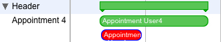

[Areas](../../guides/category-pages/areas.md)

# hmCal_INSTALL CALLBACK

`hmCal_INSTALL CALLBACK(area;methodname)`

| Parameter | Type | Direction | Description |
| --- | --- | --- | --- |
| area | Longint | -> | hmCal area |
| methodname | String | -> | callback-method |

## Contents

- [1 Description](#nummer_00001)
- [2 Parameters of the callback-method](#nummer_00002)  [3 Example](#nummer_00039)
  - [2.1 Event hmCal_UpdateAppointments (1)](#nummer_00003)
  - [2.2 Event hmCal_DragAppointment (2)](#nummer_00004)
  - [2.3 Event hmCal_ResizeAppointment (3)](#nummer_00005)
  - [2.4 Event hmCal_NewAppointment (4)](#nummer_00006)
  - [2.5 Event hmCal_DeleteAppointment (5)](#nummer_00007)
  - [2.6 Event hmCal_DoubleClickApp (6)](#nummer_00008)
  - [2.7 Event hmCal_ClickAppointment (7)](#nummer_00009)
  - [2.8 Event hmCal_DoubleClickArea (8)](#nummer_00010)
  - [2.9 Event hmCal_ClickArea (9)](#nummer_00011)
  - [2.10 Event hmCal_Drop (10)](#nummer_00012)
  - [2.11 Event hmCal_TryNewAppointment (11)](#nummer_00013)
  - [2.12 Event hmCal_TryDragAppointment (12)](#nummer_00014)
  - [2.13 Event hmCal_TryResizeAppointment (13)](#nummer_00015)
  - [2.14 Event hmCal_Error (14)](#nummer_00016)
  - [2.15 Event hmCal_Update_RRULE (15)](#nummer_00017)
  - [2.16 Event hmCal_DoubleClickRelation (16)](#nummer_00018)
  - [2.17 Event hmCal_ClickRelation (17)](#nummer_00019)
  - [2.18 Event hmCal_NewRelation (18)](#nummer_00020)
  - [2.19 Ereignis hmCal_DeleteRelation (19)](#nummer_00021)
  - [2.20 Event hmCal_ClickAppCurrent (20)](#nummer_00022)
  - [2.21 Event hmCal_DoubleClickAppCurrent (21)](#nummer_00023)
  - [2.22 Event hmCal_ResizeObject (22)](#nummer_00024)
  - [2.23 Event hmCal_SortAppointment (23)](#nummer_00025)
  - [2.24 Event hmCal_ClickMonthMore (24)](#nummer_00026)
  - [2.25 Event hmCal_DoubleClickMonthMore (25)](#nummer_00027)
  - [2.26 Event hmCal_WhileDragAppointment (26)](#nummer_00028)
  - [2.27 Event hmCal_OnEditMenu (27)](#nummer_00029)
  - [2.28 Event hmCal_CreateNewAppointment (28)](#nummer_00030)
  - [2.29 Event hmCal_OnTooltip (29)](#nummer_00031)
  - [2.30 Event hmCal_OnScroll (30)](#nummer_00032)
  - [2.31 Event hmCal_SortUser (31)](#nummer_00033)
  - [2.32 Event hmCal_TimeIndicator_MoveBegin (32)](#nummer_00034)
  - [2.33 Event hmCal_TimeIndicator_Move (33)](#nummer_00035)
  - [2.34 Event hmCal_TimeIndicator_MoveEnd (34)](#nummer_00036)
  - [2.35 Event hmCal_OnColumnHeaderClick (35)](#nummer_00037)
  - [2.36 Event hmCal_OnColumnHeaderDoubleClick (36)](#nummer_00038)

<a id="nummer_00001"></a>

## Description

With the command ***hmCal_INSTALL CALLBACK*** you can set or change the callback-method. If you put an empty string as the parameter *methodname*, an existing callbach-method is deleting.

The callback-method is necessary if you want to react to certain events, which the user in the calendar causes.

All events have to be actived explicitly with [hmCal_SET EVENT STATE](hmCal_SET-EVENT-STATE.md).

<a id="nummer_00002"></a>

## Parameters of the callback-method

| Parameter | Type | Direction | Description |
| --- | --- | --- | --- |
| $1 | Longint | -> | hmCal area |
| $2 | Longint | -> | event |
| $3 | Longint | -> | appointment-id |
| $4 | Datum | -> | from-date |
| $5 | Datum | -> | till-date |
| $6 | Longint | -> | from-time in seconds |
| $7 | Longint | -> | till-time in seconds |
| $8 | Longint | -> | full-day |
| $9 | Longint | -> | user-id |
| $0 | Longint | <- | result |

You must to be defined the method as indicated. You must always return a valid value in $0.

<a id="nummer_00003"></a>

### Event hmCal_UpdateAppointments (1)

The event is called, if you call an command, which changes the visible time range by programming language. Also the manual command [hmCal_UPDATE APPOINTMENTS](../appointments/hmCal_UPDATE-APPOINTMENTS.md) releases this event. In $4 to $7 you get the time intervall. Now you can create appointments with the command [hmCal_Add Appointment](../appointments/hmCal_Add-Appointment.md). All existing appointments are removed, so that you only create all appointments applicable on the time intervall.

The parameters *full-day* is always *0*. You have to return *0* as *result*.

**Notice: You can deactivate this mechanism with the command [hmCal_SET AREA PROPERTY](hmCal_SET-AREA-PROPERTY.md) and the selector *hmCal_prop_AutoUpdateApp*.**

<a id="nummer_00004"></a>

### Event hmCal_DragAppointment (2)

The event is called, if the user moved an appointment in the calendar. The date data refer to the recent time. The parameter *full-day* indicates whether the date is or became a full-day-appointment. If the parameter *full-day* is *0*, then the date is not a full-day-appointment. If the parameter *full-day* is *1*, then the date is a full-day-appointment.

If you accept the movement of the appointment, then you return in *result* a *0*. If you do not want to permit the movement of the appointment, then you return *-1*.

<a id="nummer_00005"></a>

### Event hmCal_ResizeAppointment (3)

The event is called, if the user extended or shortened an appointment. The parameter specifications correspond to the event *hmCal_DragAppointment*.

<a id="nummer_00006"></a>

### Event hmCal_NewAppointment (4)

The event is called, if the user creates a new appointment. This is possible in all views, except the monthly view. The parameter *full-day* indicates whether the date is a full-day-appointment. If the parameter *full-day* is *0*, then the date is not a full-day-appointment. If the parameter *full-day* is *1*, then the date is a full-day-appointment. In user views the parameter *user-id* returns your user-id, in which the appointment was created. In all other cases the parameter returns *0*.

If you do not want to permit the creation of the appointment, you return *-1* as the result. If you want to permit the creation of the appointment, then you must return your internal appointment-id as the result.

<a id="nummer_00007"></a>

### Event hmCal_DeleteAppointment (5)

The event is called, if the user liked to delete an appointment by the erase key (del) or the backspace key. The parameters *full-day* and *user-id* are always *0*. If you do not accept the deletion of the appointment, then you return *-1*, otherwise *0*.

If you did not like that the user deletes an appointment, then you can use also the command [hmCal_SET AREA PROPERTY](hmCal_SET-AREA-PROPERTY.md) with the selector *hmCal_prop_DeleteKey*. However, then the callback-event will not be executing.

<a id="nummer_00008"></a>

### Event hmCal_DoubleClickApp (6)

The event is called, if you doubleclick on an appointment. The parameter *full-day* indicates whether the appointment is a full-day-appointment. The result should be always *0*.

<a id="nummer_00009"></a>

### Event hmCal_ClickAppointment (7)

The event is called, if you click on an appointment. The parameter *full-day* indicates whether the date is a full-day-appointment. The result should be alwyays *0*.

<a id="nummer_00010"></a>

### Event hmCal_DoubleClickArea (8)

The event is called, if you the user doubleclicked in the calendar. In parameters *$4* and *$6* the date and time is returned, on which was doubleclicked. The parameter *full-day* indicates whether the user clicked in the full-day area of the calendar. The parameter *user-id* indicates in multi-user views, on which user was clicked. The result should be *0*.

<a id="nummer_00011"></a>

### Event hmCal_ClickArea (9)

The event is called, if you the user clicked in the calendar. In parameters *$4* and *$6* the date and time is returned, on which was clicked. The parameter *full-day* indicates whether the user clicked in the full-day area of the calendar. The parameter *user-id* indicates in multi-user views, on which user was clicked. The result should be *0*.

<a id="nummer_00012"></a>

### Event hmCal_Drop (10)

The event is called, if an element were droped into the calendar. The calendar-area must have the property *dropable* in the 4D design mode. In parameters *$4* and *$6* the date and time is returned, on which the element was released. The parameter *full-day* indicates whether the element was released within the full-day area of the calendar. The parameter *user-id* indicates in multi-user views, on which user the element was released. In the parameter *appointment-id* the reference of the appointment is returned, on which the element was droped.

With the help of the command [hmCal_DRAG AND DROP PROPERTIES](hmCal_DRAG-AND-DROP-PROPERTIES.md) you can get further information about the source element.

<a id="nummer_00013"></a>

### Event hmCal_TryNewAppointment (11)

The event is called before an user creates a new appointment in the calendar with drag and drop. hmCal asks you, if the creation of appointments in this context is allowed. If you deny the creation of an appointment, return *-1* as result. Otherwise return *0*. The event is only called if the creation of new appointments is allowed (see chapter[hmCal_SET AREA PROPERTY](hmCal_SET-AREA-PROPERTY.md) selector *hmCal_prop_AllowDragNew*).

<a id="nummer_00014"></a>

### Event hmCal_TryDragAppointment (12)

The event is called before an user drags an appointments in the calendar. If you deny the modification of an appointment, return *-1* as result. Otherwise return *0*.

<a id="nummer_00015"></a>

### Event hmCal_TryResizeAppointment (13)

The event is called before an user resizes an appointments in the calendar. If you deny the modification of an appointment, return *-1* as result. Otherwise return *0*.

<a id="nummer_00016"></a>

### Event hmCal_Error (14)

The event is called if an error occurs. Here you can handle all erros. The error code is in the parameter *$3*.

<a id="nummer_00017"></a>

### Event hmCal_Update_RRULE (15)

The event is called if hmCal changes internally the rules for an recurrence appointment. Here you have the chance to get the rule properties and save them into your database.

The rule for the exdate list is changed, if the user changes the starttime of the main appointment or the user deletes any child appointments.

<a id="nummer_00018"></a>

### Event hmCal_DoubleClickRelation (16)

The event is called, if the user double clicks on a relation. The relation ID is in the parameter *$3*.

<a id="nummer_00019"></a>

### Event hmCal_ClickRelation (17)

The event is called, if the user clicks on a relation. The relation ID is in the parameter *$3*.

<a id="nummer_00020"></a>

### Event hmCal_NewRelation (18)

The event is called, if the user tries to create a new [relation](../../guides/relations/Relations.md)with drag & drop. You get the source appointment reference in the parameter *$3* and the target appointment reference in the parameter *$8*.

The parameter *$9* returns the relation type.

The result is your relation id. If you pass *-1* as a result, the relation is not created.

<a id="nummer_00021"></a>

### Ereignis hmCal_DeleteRelation (19)

The event is called, if the user tries to delete a relation with the delete-key.

If you want to deny the deletion of the relation, just pass *-1* as a result. If you accept the deletion, just return *0*.

If you generelly deny any deletion of relations, you can call the command [hmCal_SET AREA PROPERTY](hmCal_SET-AREA-PROPERTY.md) with the selector *hmCal_prop_DeleteKey*. Then the event is not called any more.

<a id="nummer_00022"></a>

### Event hmCal_ClickAppCurrent (20)

The event is called, if the user clicks on the second appointment bar in the project view.

Here is an example of a second bar under the regular bar:



<a id="nummer_00023"></a>

### Event hmCal_DoubleClickAppCurrent (21)

The event is called, if the user doubleclicks on the second appointment bar in the project view.

<a id="nummer_00024"></a>

### Event hmCal_ResizeObject (22)

The event is called, if the user drags an object or area. The event is called multiple times while the object is dragging by the user. If the parameter *$3* returns a *1*, the size of the multi-day area hast changed.

<a id="nummer_00025"></a>

### Event hmCal_SortAppointment (23)

The event is called, if an appointment was sorted by drag and drop. Sorting is only available in the project area. The event is called after the sort, if the mouse button was released. You get the dragged appointment in the parameter *$3*. You get the appointment id of the appointment, after where the dragged appointment was released in the parameter *$9*.

<a id="nummer_00026"></a>

### Event hmCal_ClickMonthMore (24)

This event is called, if the user clicks in the "more"-icon in the month view. The icon appears, if there are too much appointments for a day. The parameter *$4* returns the date where the user clicked.

<a id="nummer_00027"></a>

### Event hmCal_DoubleClickMonthMore (25)

This event is called, if the user double clicks in the "more"-icon in the month view. The icon appears, if there are too much appointments for a day. The parameter *$4* returns the date where the user double clicked.

<a id="nummer_00028"></a>

### Event hmCal_WhileDragAppointment (26)

The event is called, if the user moved an appointment in the calendar and don't released the mouse button. The date data refer to the recent time. The parameter *full-day* indicates whether the date is or became a full-day-appointment. If the parameter *full-day* is *0*, then the date is not a full-day-appointment. If the parameter *full-day* is *1*, then the date is a full-day-appointment. Pass a non null value in *$0* to indicate a *not allowed*-cursor to the user.

<a id="nummer_00029"></a>

### Event hmCal_OnEditMenu (27)

The event is called, if the user selects an edit menu item: Undo (1), Cut (2), Copy (3), Paste (4), Clear (5), Select all (6) and Redo (7). *$3* returns the item number (see number behind).

If you return in *$0* an other value as *0*, hmCal does not executes standard actions.

These following standard actions are executed:

Clear: Same as the delete key: it deletes the current selected appointments. The event *hmCal_DeleteAppointment* is called for every appointment where you can deny the action for each appointment

Select all: Selects all appointments in the current view

<a id="nummer_00030"></a>

### Event hmCal_CreateNewAppointment (28)

The event is called, before the user drags a new appointment. Within this event you can set default properties (texts, colors, etc.) before the appointment is shown. This event is called after *hmCal_TryNewAppointment*. The appointment ID is a placeholder for the new appointment id, which will be set, if you accept the creation with *hmCal_NewAppointment*. By default the ID is -1, but can be changed with the area property *hmCal_prop_NewAppointmentID*. So this ID, is valid within this event only.

<a id="nummer_00031"></a>

### Event hmCal_OnTooltip (29)

The event is called, before a tooltip for an appointment is shown. If you return in $0 not *0*, the tooltip will not be shown.

<a id="nummer_00032"></a>

### Event hmCal_OnScroll (30)

The event is called, after the user scrolls with the scrollbar. The event is not fired while dragging the thumb, because of performance issues. In *$3* you will get the scrollbar type:

- Type 1: vertical scrollbar
- Type 2: vertical scrollbar of the full day area
- Type 3: horizontal scrollbar
- Type 4: horizontal scrollbar of the column area

In *$4-$7* you will get the current visible time range.

<a id="nummer_00033"></a>

### Event hmCal_SortUser (31)

The event is called, after the user sorts a user row in the user multi day view. In the parameter *$3* you will get the user reference which will be sorted. In *$9* you will get the destination user reference (where the user released the mouse button).

If you return in $0 not *0*, the sort action will be rejected.

<a id="nummer_00034"></a>

### Event hmCal_TimeIndicator_MoveBegin (32)

The event is called at the beginning of the drag & drop action of the time-indicator. You will get the current time indicator in the parameter *$3*.

<a id="nummer_00035"></a>

### Event hmCal_TimeIndicator_Move (33)

The event is called during the drag & drop action of the time-indicator. You will get the current time indicator in the parameter *$3*.

<a id="nummer_00036"></a>

### Event hmCal_TimeIndicator_MoveEnd (34)

The event is called after the drag & drop action of the time-indicator. You will get the current time indicator in the parameter *$3*.

<a id="nummer_00037"></a>

### Event hmCal_OnColumnHeaderClick (35)

The event is called, if the user clicks on a column header. The parameter *$3* returns the column ID.

<a id="nummer_00038"></a>

### Event hmCal_OnColumnHeaderDoubleClick (36)

The event is called, if the user double clicks on a column header. The parameter *$3* returns the column ID.

<a id="nummer_00039"></a>

## Example

```4d
C_LONGINT($0;$1;$2;$3;$6;$7;$8;$9;$vl_area;$vl_event;$vl_appointment;$vl_time1;$vl_time2;$vl_ganztag; $vl_user;$vl_return)
C_DATE($vd_date1;$vd_date2)
C_TIME($vu_time1;$vu_time2)

$vl_return:=0

$vl_area:=$1
$vl_event:=$2
$vl_appointment:=$3
$vd_date1:=$4
$vd_date2:=$5
$vl_time1:=$6
$vl_time2:=$7
$vl_ganztag:=$8
$vl_user:=$9

$vu_time1:=00:00:00+$vl_time1
$vu_time2:=00:00:00+$vl_time2

Case of 
  :($vl_event=hmCal_UpdateAppointments )

  :($vl_event=hmCal_DragAppointment )
	
  :($vl_event=hmCal_ResizeAppointment )

  :($vl_event=hmCal_NewAppointment )

  :($vl_event=hmCal_DeleteAppointment )

  :($vl_event=hmCal_DoubleClickApp )
	
  :($vl_event=hmCal_ClickAppointment )

End case 

$0:=$vl_return
```
