[Areas](../../guides/category-pages/areas.md)

# hmCal_SET AREA PROPERTY

`hmCal_SET AREA PROPERTY(area;property;value)`

| Parameter | Type | Direction | Description |
| --- | --- | --- | --- |
| area | Longint | -> | hmCal area |
| property | Longint | -> | area property |
| value | Longint | -> | value to set |

## Contents

- [1 Description](#nummer_00001)
- [2 Properties](#nummer_00002)  [3 Example](#nummer_00095)
  - [2.1 hmCal_prop_UserListWidth (1)](#nummer_00003)
  - [2.2 hmCal_prop_MultiDayArea (2)](#nummer_00004)
  - [2.3 hmCal_prop_SwitchUser (3)](#nummer_00005)
  - [2.4 hmCal_prop_NewLineHeight (4)](#nummer_00006)
  - [2.5 hmCal_prop_DefaultEffect (5)](#nummer_00007)
  - [2.6 hmCal_prop_MultiLine (6)](#nummer_00008)
  - [2.7 hmCal_prop_Overlapping (7)](#nummer_00009)
  - [2.8 hmCal_prop_ScrollAutoHide (8)](#nummer_00010)
  - [2.9 hmCal_prop_ColumnWidth (9)](#nummer_00011)
  - [2.10 hmCal_prop_DisplayTime (10)](#nummer_00012)
  - [2.11 hmCal_prop_AllowDragNew (11)](#nummer_00013)
  - [2.12 hmCal_prop_DeleteKey (12)](#nummer_00014)
  - [2.13 hmCal_prop_FreezeView_V (13)](#nummer_00015)
  - [2.14 hmCal_prop_ShowMonthHeader (14)](#nummer_00016)
  - [2.15 hmCal_prop_LeftBarWidth (15)](#nummer_00017)
  - [2.16 hmCal_prop_FreezeView_H (16)](#nummer_00018)
  - [2.17 hmCal_prop_IndicateOutsideApp (17)](#nummer_00019)
  - [2.18 hmCal_prop_GridCaption (18)](#nummer_00020)
  - [2.19 hmCal_prop_GridHourLine (19)](#nummer_00021)
  - [2.20 hmCal_prop_GridHalfHourLine (20)](#nummer_00022)
  - [2.21 hmCal_prop_Add3points (21)](#nummer_00023)
  - [2.22 hmCal_prop_OneLineCaption (22)](#nummer_00024)
  - [2.23 hmCal_prop_RepeatTimeline (23)](#nummer_00025)
  - [2.24 hmCal_prop_ShowTimeline (24)](#nummer_00026)
  - [2.25 hmCal_prop_ShowHeader (25)](#nummer_00027)
  - [2.26 hmCal_prop_CurrentTimeIndicator (26)](#nummer_00028)
  - [2.27 hmCal_prop_GMTexport (27)](#nummer_00029)
  - [2.28 hmCal_prop_MultiDayAreaHeight (28)](#nummer_00030)
  - [2.29 hmCal_prop_AutoMonthWeeks (29)](#nummer_00031)
  - [2.30 hmCal_prop_MultiDayAreaResize (30)](#nummer_00032)
  - [2.31 hmCal_prop_ColumnLines (31)](#nummer_00033)
  - [2.32 hmCal_prop_DragTimeVisible (32)](#nummer_00034)
  - [2.33 hmCal_prop_proj_scaleweek (33)](#nummer_00035)
  - [2.34 hmCal_prop_proj_scalemonth (34)](#nummer_00036)
  - [2.35 hmCal_prop_proj_scalequarter (35)](#nummer_00037)
  - [2.36 hmCal_prop_proj_scaleyear (36)](#nummer_00038)
  - [2.37 hmCal_prop_PrintingWidth (37)](#nummer_00039)
  - [2.38 hmCal_prop_PrintingHeight (38)](#nummer_00040)
  - [2.39 hmCal_prop_ProjectAreaHeight (39)](#nummer_00041)
  - [2.40 hmCal_prop_DrawAsRect (40)](#nummer_00042)
  - [2.41 hmCal_prop_ShowResources (41)](#nummer_00043)
  - [2.42 hmCal_prop_SyncArea (42)](#nummer_00044)
  - [2.43 hmCal_prop_UserListLock (43)](#nummer_00045)
  - [2.44 hmCal_prop_AutoUpdateApp (44)](#nummer_00046)
  - [2.45 hmCal_prop_ResourcesHourGrid (45)](#nummer_00047)
  - [2.46 hmCal_prop_MaxLines (46)](#nummer_00048)
  - [2.47 hmCal_prop_TimelineShift (47)](#nummer_00049)
  - [2.48 hmCal_prop_Lineheight (48)](#nummer_00050)
  - [2.49 hmCal_prop_proj_ShowHourLines (49)](#nummer_00051)
  - [2.50 hmCal_prop_ShowWeekNo (50)](#nummer_00052)
  - [2.51 hmCal_prop_WeekNoWidthMonth (51)](#nummer_00053)
  - [2.52 hmCal_prop_NewMonthView (52)](#nummer_00054)
  - [2.53 hmCal_prop_MaxAppHeightMonth (53)](#nummer_00055)
  - [2.54 hmCal_prop_ScrollInMonthView (54)](#nummer_00056)
  - [2.55 hmCal_prop_ShowTextOnBar (55)](#nummer_00057)
  - [2.56 hmCal_prop_IndicatorOffset (56)](#nummer_00058)
  - [2.57 hmCal_prop_AppRealloc (57)](#nummer_00059)
  - [2.58 hmCal_prop_MultiAreaHeight (58)](#nummer_00060)
  - [2.59 hmCal_prop_ColumnTextOffsetV (59)](#nummer_00061)
  - [2.60 hmCal_prop_AreaVisible (60)](#nummer_00062)
  - [2.61 hmCal_prop_MonthLineHeight (61)](#nummer_00063)
  - [2.62 hmCal_prop_GhostApppointment (62)](#nummer_00064)
  - [2.63 hmCal_prop_AutoSwitchFullDay (63)](#nummer_00065)
  - [2.64 hmCal_prop_RelationsInView5 (64)](#nummer_00066)
  - [2.65 hmCal_prop_StaticArea (65)](#nummer_00067)
  - [2.66 hmCal_prop_StaticSecPerPixel (66)](#nummer_00068)
  - [2.67 hmCal_prop_HScrollbarColumn (67)](#nummer_00069)
  - [2.68 hmCal_prop_TimelinePosition (68)](#nummer_00070)
  - [2.69 hmCal_prop_FirstDisplUserID (69)](#nummer_00071)
  - [2.70 hmCal_prop_HierarchicalView5 (70)](#nummer_00072)
  - [2.71 hmCal_prop_TimelineFullHours (71)](#nummer_00073)
  - [2.72 hmCal_prop_SelectionThickness (72)](#nummer_00074)
  - [2.73 hmCal_prop_ShowUserDescription (73)](#nummer_00075)
  - [2.74 hmCal_prop_NewFullDay (74)](#nummer_00076)
  - [2.75 hmCal_prop_NewAppointmentID (75)](#nummer_00077)
  - [2.76 hmCal_prop_CurrentTimeIndicatorMoveable (76)](#nummer_00078)
  - [2.77 hmCal_prop_TimeIndicator (77)](#nummer_00079)
  - [2.78 hmCal_prop_Edge (78)](#nummer_00080)
  - [2.79 hmCal_prop_UserSortable (79)](#nummer_00081)
  - [2.80 hmCal_prop_InvertSelection (80)](#nummer_00082)
  - [2.81 hmCal_prop_3LinesHeader (81)](#nummer_00083)
  - [2.82 hmCal_prop_Barheight (82)](#nummer_00084)
  - [2.83 hmCal_prop_TimelineDescrOffsetV (83)](#nummer_00085)
  - [2.84 hmCal_prop_HeaderLineHeight1 (84)](#nummer_00086)
  - [2.85 hmCal_prop_HeaderLineHeight2 (85)](#nummer_00087)
  - [2.86 hmCal_prop_HeaderLineHeight3 (86)](#nummer_00088)
  - [2.87 hmCal_prop_DaylineFromHeader (87)](#nummer_00089)
  - [2.88 hmCal_prop_ScrollIncrementSeconds (88)](#nummer_00090)
  - [2.89 hmCal_prop_DescrTextInProjectView (89)](#nummer_00091)
  - [2.90 hmCal_prop_ScrollIncrementPixels (90)](#nummer_00092)
  - [2.91 hmCal_prop_IconsRight (91)](#nummer_00093)
  - [2.92 hmCal_prop_BulletMonthView (92)](#nummer_00094)

<a id="nummer_00001"></a>

## Description

The command***hmCal_SET AREA PROPERTY*** sets several properties of the area. With the parameter *property*, you can decide, which information, is to be set. See also chapter [Constants](../../guides/appendix/Constants.md).

To get properties about the area you can use the command [hmCal_Get Area Property](hmCal_Get-Area-Property.md).

<a id="nummer_00002"></a>

## Properties

<a id="nummer_00003"></a>

### hmCal_prop_UserListWidth (1)

The property sets the width of the user list in the user multi day view in pixels. The value must amount to at least 10. This value can be read and written both.

<a id="nummer_00004"></a>

### hmCal_prop_MultiDayArea (2)

The property shows or hides the full-day-area of the area. The full-day-area is in the daily view, user daily view and the multi day view. If value is set to *1*, then the full-day-area is shown. If value is set to *0*, then the full-day-area is hide. This value can be read and written both.

<a id="nummer_00005"></a>

### hmCal_prop_SwitchUser (3)

With the help of this property you can specify whether the user may shift appointments between several users by drag & drop in user views. If you set the value to *1*, the user may shift appointments between the users by drag & drop. If you set the value to *0* the user cannot shift appointments between the users. This value can be read and written both.

<a id="nummer_00006"></a>

### hmCal_prop_NewLineHeight (4)

With the property you can specify, how much space should be, to create a new appointment by drag and drop (see picture). Only values between 0 and 20 are valid. This value can be read and written both.

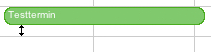

<a id="nummer_00007"></a>

### hmCal_prop_DefaultEffect (5)

With the property you can specify, which is the default effect for new created appointments.

<a id="nummer_00008"></a>

### hmCal_prop_MultiLine (6)

The property defines, if a full day appointment can be multi line or not. You also need to set the maximum lines with the property *hmCal_prop_MaxLines*.

<a id="nummer_00009"></a>

### hmCal_prop_Overlapping (7)

With the property you can set, that appointments can overlap other appointments. If you set the value to *1*, all appointments are drawn half overlapped. Use value *2* for fully overlapped. If you set the value to *0*, all appointments are drawn not overlapped. The standard-value is *1*. This value can be read and written both.

You can use the constants:

- hmCal_Overlapping_None
- hmCal_Overlapping_Half
- hmCal_Overlapping_Complete

Example:

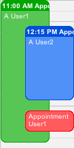

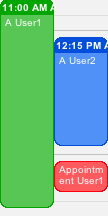

(left: overlapped, right: not overlapped)

<a id="nummer_00010"></a>

### hmCal_prop_ScrollAutoHide (8)

If you set the value to *1*, all scrollbars will be only displayed if necessary. If you set the value to *0*, all scrollbars are always visible. The standard-value is *0*. This value can be read and written both.

<a id="nummer_00011"></a>

### hmCal_prop_ColumnWidth (9)

The property returns the column width in the day view, user day view, user day view and user multi day view in pixels. If you are activate the option *hmCal_prop_StaticArea* you can also write this property. Else this option can be read only.

<a id="nummer_00012"></a>

### hmCal_prop_DisplayTime (10)

With the property you can set, if the time should be visible in the appointment header. The standard-value is *1*. This value can be read and written both.

<a id="nummer_00013"></a>

### hmCal_prop_AllowDragNew (11)

The property defines if the user can create appointments by dragging the mouse. This is possible in all views, except the month view. If activated the callback-event *hmCal_NewAppointment* will released. See chapter [hmCal_INSTALL CALLBACK](hmCal_INSTALL-CALLBACK.md). This value can be read and written both.

<a id="nummer_00014"></a>

### hmCal_prop_DeleteKey (12)

The property defines if the delete key should be used in the calendar. If the delete key is deactivated the callback-event *hmCal_DeleteAppointment* will not released. See chapter [hmCal_INSTALL CALLBACK](hmCal_INSTALL-CALLBACK.md). This value can be read and written both.

<a id="nummer_00015"></a>

### hmCal_prop_FreezeView_V (13)

With the property you can freeze the current view vertically. The user cannot scroll anymore. This value can be read and written both.

<a id="nummer_00016"></a>

### hmCal_prop_ShowMonthHeader (14)

With the property you can show or hide the headline of the month view. If you set the value to *1*, the headline will be shown. If you set the value to *0*, the headline will be hide. The standard-value is *1*. This value can be read and written both.

<a id="nummer_00017"></a>

### hmCal_prop_LeftBarWidth (15)

With the property you can define the width of the left bar using the effect *hmCal_Effect_LeftBar*. Only values between 1 and 20 are valid. This value can be read and written both.

<a id="nummer_00018"></a>

### hmCal_prop_FreezeView_H (16)

With the property you can freeze the current view horizontally. The user cannot scroll anymore. This value can be read and written both.

<a id="nummer_00019"></a>

### hmCal_prop_IndicateOutsideApp (17)

With this property you can indicate the user, that there are appointments outside the visible area. The property only works in the day view, multi day view and user day view.

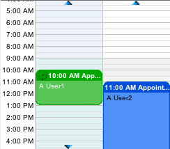

<a id="nummer_00020"></a>

### hmCal_prop_GridCaption (18)

With this property you can set the distance in minutes of the time captions of the vertical timeline. Default is 60 (minutes). This value can be read and written both.

*Example:*

The following example shows one hour. The caption of the y-axis shall be drawn every 15 minutes. Call the command as follows:

```4d
hmCal_SET AREA PROPERTY (hmCal;hmCal_prop_GridCaption;15)
```

And all halfhourlines shall be drawn every 5 minutes:

```4d
hmCal_SET AREA PROPERTY (hmCal;hmCal_prop_GridHalfHourLine;5)
```

That's the result:

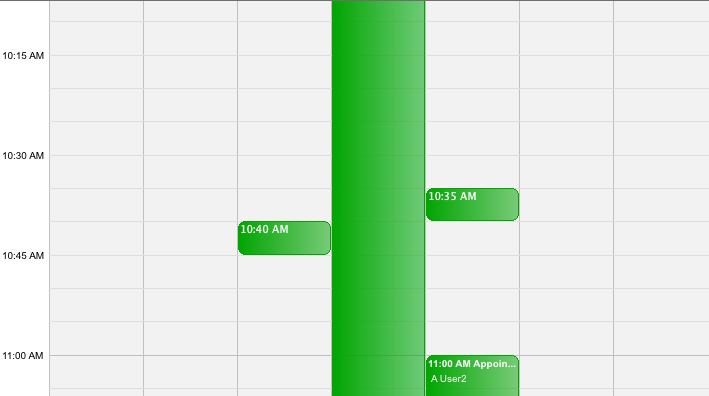

<a id="nummer_00021"></a>

### hmCal_prop_GridHourLine (19)

With this property you can set the distance in minutes of the hourlines in the calendar. Default is 60 (minutes). This value can be read and written both.

<a id="nummer_00022"></a>

### hmCal_prop_GridHalfHourLine (20)

With this property you can set the distance in minutes of the halfhourlines in the calendar. Default is 30 (minutes). This value can be read and written both.

<a id="nummer_00023"></a>

### hmCal_prop_Add3points (21)

***Obsolete/Unsupported since hmCal 4.0***

<a id="nummer_00024"></a>

### hmCal_prop_OneLineCaption (22)

With this property you can define which text of an appointment is shown if the appointment is displayed as a single line. A value of *1* shows the header text and a value *0* shows the description text of the appointment. This value can be read and written both.

The following example define, that the header text is shown, if the appointment is displayed as a single line:

```4d
hmCal_SET AREA PROPERTY (calarea;hmCal_prop_OneLineCaption;1)
```

<a id="nummer_00025"></a>

### hmCal_prop_RepeatTimeline (23)

With this property you can define, if the timeline should be visible at each user. If you pass a value of *1* the timeline is repeated for each single user. This value can be read and written both.

Example view:

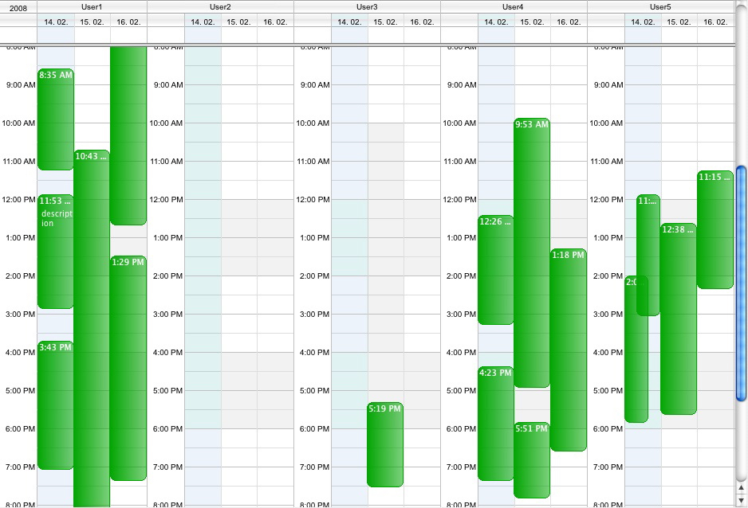

<a id="nummer_00026"></a>

### hmCal_prop_ShowTimeline (24)

With this property you can define, if the timeline should be visible in the day view, user day view and the multi day view. This value can be read and written both.

<a id="nummer_00027"></a>

### hmCal_prop_ShowHeader (25)

With this property you can define, if the day header should be visible in the day view, user day view, user multi day view and the multi day view. This value can be read and written both.

<a id="nummer_00028"></a>

### hmCal_prop_CurrentTimeIndicator (26)

With this property you can display an horizontal line with the current time in the day view, multi day view and user day view.

Example:

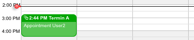

<a id="nummer_00029"></a>

### hmCal_prop_GMTexport (27)

The property defines, if the iCalendar export ([hmCal_Export Appointments](../calendar/hmCal_Export-Appointments.md)) should always export as GMT time.

<a id="nummer_00030"></a>

### hmCal_prop_MultiDayAreaHeight (28)

With this property, you can specify how big the multi day area in pixels should be. Pass *0* for automatically. That means the area will automatically resize depending on the number of full day appointments.

<a id="nummer_00031"></a>

### hmCal_prop_AutoMonthWeeks (29)

The property activates the month automatism in hmCal. The property is only valid in the month view. If the automatic is actived the month view begins with the 1st of the month. The number of weeks will automatically calculated. If the mode is deactivated, you can display weeks independent from the 1st of the month. For example you can show three weeks from August 15th.

<a id="nummer_00032"></a>

### hmCal_prop_MultiDayAreaResize (30)

With this property you can set whether the multi day area can be enlarged by the user or not. Pass *0* for disable or *1* for enable.

<a id="nummer_00033"></a>

### hmCal_prop_ColumnLines (31)

With this property, you can specify how many rows of the columns may be wrapped up. Pass a *0*, then the number is unlimited. The property is only valid for the project view.

<a id="nummer_00034"></a>

### hmCal_prop_DragTimeVisible (32)

With this property, you can set the visibility of the time if the user drags an appointment. Pass a *0* for invisible and *1* visible. Standard is *1* for visible.

<a id="nummer_00035"></a>

### hmCal_prop_proj_scaleweek (33)

With this property you can define, if the header should turn to the week mode. This property is only valid in the project view. The value relates to seconds per pixel. Standard is 1500.

<a id="nummer_00036"></a>

### hmCal_prop_proj_scalemonth (34)

With this property you can define, if the header should turn to the month mode. This property is only valid in the project view. The value relates to seconds per pixel. Standard is 5000.

<a id="nummer_00037"></a>

### hmCal_prop_proj_scalequarter (35)

With this property you can define, if the header should turn to the quarter mode. This property is only valid in the project view. The value relates to seconds per pixel. Standard is 15000.

<a id="nummer_00038"></a>

### hmCal_prop_proj_scaleyear (36)

With this property you can define, if the header should turn to the year mode. This property is only valid in the project view. The value relates to seconds per pixel. Standard is 20000.

<a id="nummer_00039"></a>

### hmCal_prop_PrintingWidth (37)

With this property you can set the width of the printing area. If you want to create an image with the command [hmCal_Area To Picture](hmCal_Area-To-Picture.md) you can change the width of the picture. Just pass the width of the picture in the parameter *value*. Pass *0* for the default size. This value can be read and written both.

<a id="nummer_00040"></a>

### hmCal_prop_PrintingHeight (38)

With this property you can set the height of the printing area. If you want to create an image with the command [hmCal_Area To Picture](hmCal_Area-To-Picture.md) you can change the height of the picture. Just pass the height of the picture in the parameter *value*. Pass *0* for the default size. This value can be read and written both.

<a id="nummer_00041"></a>

### hmCal_prop_ProjectAreaHeight (39)

With this property you can get the needed height of the projectarea. See picture:

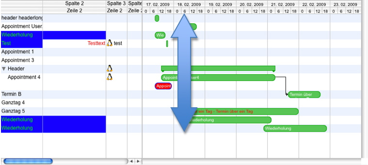

<a id="nummer_00042"></a>

### hmCal_prop_DrawAsRect (40)

With this property you can set the default value of new appointments. Further informations in the chapter [hmCal_Set App Property](../appointments/hmCal_Set-App-Property.md), property *hmCal_aprop_DrawAsRect*.

<a id="nummer_00043"></a>

### hmCal_prop_ShowResources (41)

With this property you can define, if the resources/users are shown under the appointments in the project view. Default is *0*. If you set *1*, the users are shown under the appointment:

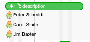

<a id="nummer_00044"></a>

### hmCal_prop_SyncArea (42)

This property is obsolete.

<a id="nummer_00045"></a>

### hmCal_prop_UserListLock (43)

With this property you can define, if the listview can be resized in width by the user. Pass *0* in value for resizeable or *1* for resizeable.

<a id="nummer_00046"></a>

### hmCal_prop_AutoUpdateApp (44)

With this property you can activate or deactive the Auto-Update-Mode of appointments. Default the mode is activated. If the time range has changed in hmCal, the auto update mode deletes all appointments and the event *hmCal_UpdateAppointments* is called in the callback method. If you do not want the mechanism, you can deactivate this. Pass *0* in value for deactivation.

<a id="nummer_00047"></a>

### hmCal_prop_ResourcesHourGrid (45)

With this property you can define in the resources view, in how many columns each hour should be divided.

Example:

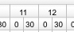

```4d
hmCal_SET AREA PROPERTY (eExt1;hmCal_prop_ResourcesHourGrid ;2)
```

<a id="nummer_00048"></a>

### hmCal_prop_MaxLines (46)

With this property you can define the maximal count of lines, in which a full day appointment can break. Standard is *1*.

<a id="nummer_00049"></a>

### hmCal_prop_TimelineShift (47)

With this property you can define the offset of the timeline in seconds. The setting only shift the timeline, not the appointments! Standard is *0*.

<a id="nummer_00050"></a>

### hmCal_prop_Lineheight (48)

With this property you can set the height of the appointments in the multi user view and the project view. You have to pass at least 20 (pixel) in value.

<a id="nummer_00051"></a>

### hmCal_prop_proj_ShowHourLines (49)

With this property you can show or hide the vertical hour-lines in the project view. Pass *1* for visible or *0* for invisible. Standard is *0*.

<a id="nummer_00052"></a>

### hmCal_prop_ShowWeekNo (50)

With this property you can show or hide the week numbers in the month view. Pass *1* for visible or *0* for invisible. Standard is *0*.

<a id="nummer_00053"></a>

### hmCal_prop_WeekNoWidthMonth (51)

With this property you can set the width of the week numbers area in the month view. Pass the width in pixels. Standard is 40 pixels.

<a id="nummer_00054"></a>

### hmCal_prop_NewMonthView (52)

With this property you can activate the new month view. In the new month you can scroll in each day if there are too many appointments to show. Pass *1* for new month view or *0* for the old month view behaviour. Standard is *1* = new month view.

<a id="nummer_00055"></a>

### hmCal_prop_MaxAppHeightMonth (53)

With this property you can define the maximum height (in pixels) of an appointment in the month view. Pass the height in pixels or *0* for automatically (unlimited). Standard is *0*.

<a id="nummer_00056"></a>

### hmCal_prop_ScrollInMonthView (54)

With this property you define, if the user can scroll in a day in the month view or not. The user can only scroll if there are too many appointments in a day, that scrolling is necessary.

Pass *1* for scrolling or *0* for not scrolling. Standard is *1*.

<a id="nummer_00057"></a>

### hmCal_prop_ShowTextOnBar (55)

With this property you define, if the appointment description text is visible on the bar in the project view. Pass *1* for visible or *0* for invisible. Standard is *1*.

<a id="nummer_00058"></a>

### hmCal_prop_IndicatorOffset (56)

With this property you define an offset of the current time indicator line. Pass the count of seconds in *value*. Standard is *0*.

<a id="nummer_00059"></a>

### hmCal_prop_AppRealloc (57)

With this property, you can define the size of the internal memory allocation. Standard is *100*. The value defines, for how many appointments' memory is allocated. This is helpful, e. g. if you want to create several thousands appointments, you should set the value to the known count of these appointments. In this case, all necessary memory for the count of appointments will be allocated. This avoids coping memory through realloction.

<a id="nummer_00060"></a>

### hmCal_prop_MultiAreaHeight (58)

With this property, you can get the needed space in pixels for the full-day-area of the day, week or user-day view. In all other views a value of *0* will be returned. This value can be read only.

<a id="nummer_00061"></a>

### hmCal_prop_ColumnTextOffsetV (59)

With this property, you can set a vertical text offset in pixels within a column (user-week view, project view or resources view). Standard is *0*.

<a id="nummer_00062"></a>

### hmCal_prop_AreaVisible (60)

This property is obsolete.

<a id="nummer_00063"></a>

### hmCal_prop_MonthLineHeight (61)

This property sets the standard height of full day appointments in the month view. Standard value is *16* pixels.

<a id="nummer_00064"></a>

### hmCal_prop_GhostApppointment (62)

With this property you can activate (=1) a ghost appointment while dragging. That means, that the user can see the origin position of the appointment while dragging the appointment to a new position:

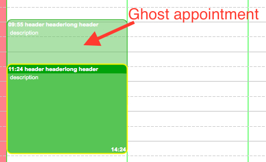

The option is deactivated (=0) by default.

<a id="nummer_00065"></a>

### hmCal_prop_AutoSwitchFullDay (63)

With this property, you can define if an appointment can become a full day or not-full day appointment while dragging to the full day area or to the week view. This option is deactivated by default (=0).

<a id="nummer_00066"></a>

### hmCal_prop_RelationsInView5 (64)

If this property is set, relations are visible and supported in view *hmCal_UserMultiDayView*. This option is deactived by default.

<a id="nummer_00067"></a>

### hmCal_prop_StaticArea (65)

With this property you can deactivate the auto-resize mechanism of hmCal. By default, all days, columns and apointments are fit to the current area size. If you want to set a specific width of each day, which will not change by resizing the area, you can activate this option (=1). This option is deactivated (=0) by default.

If this option is active, you also have to set *hmCal_prop_StaticSecPerPixel* to set the size of seconds per pixels and the *hmCal_prop_ColumnWidth* to set the width of the columns.

This mode is currently available for the following views:

- 1 - day view
- 2 - multi day view
- 9 - day user view

<a id="nummer_00068"></a>

### hmCal_prop_StaticSecPerPixel (66)

If *hmCal_prop_StaticArea* is active, you can set the count of seconds per pixel. If *hmCal_prop_StaticArea* is deactivated, you can read this option only, because it's calculated dynamically.

<a id="nummer_00069"></a>

### hmCal_prop_HScrollbarColumn (67)

This option sets and gets the current scroll position of the horizontal scrollbar of the views with columns.

<a id="nummer_00070"></a>

### hmCal_prop_TimelinePosition (68)

This property sets the timeline to s specific position: 1=left (Standard), 2=right.

<a id="nummer_00071"></a>

### hmCal_prop_FirstDisplUserID (69)

This option gets and sets the first displayed user reference in the user day view. Pass *0* as reference, then hmCal scrolls to the first user.

<a id="nummer_00072"></a>

### hmCal_prop_HierarchicalView5 (70)

If this property is set, appointments are displayed hierarchically in view *hmCal_UserMultiDayView*. This option is deactived by default. To set a user's hierarchy, you have to set a superior user in [hmCal_Set User Property](../user/hmCal_Set-User-Property.md).

<a id="nummer_00073"></a>

### hmCal_prop_TimelineFullHours (71)

If the property is set to *1*, the time line has a differnt format for full hours and non full hours. You can set the format with [hmCal_SET FORMAT](../calendar-settings/hmCal_SET-FORMAT.md). *0*=off is default.

Example with option off (default):

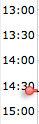

Example with option on:

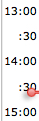

<a id="nummer_00074"></a>

### hmCal_prop_SelectionThickness (72)

This property defines the thickness of selected appointments. Standard is *2*. You can set a value between 1 and 10.

This example sets the thickness of the selection to a size of 5 pixels:

```4d
hmCal_SET AREA PROPERTY (calArea;hmCal_prop_SelectionThickness;5)
```

Result:

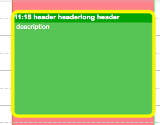

<a id="nummer_00075"></a>

### hmCal_prop_ShowUserDescription (73)

This property defines for the User-Day-View, if the user description is shown instead of the date in the header (second row).

<a id="nummer_00076"></a>

### hmCal_prop_NewFullDay (74)

This property defines for the User-Multi-Day-View and Year view, if a new appointment is created as a full day appointment.

<a id="nummer_00077"></a>

### hmCal_prop_NewAppointmentID (75)

This property defines the ID for new appointments. This ID is a placeholder for manipulation appointment properties within the callback event *hmCal_CreateNewAppointment*. Default is -1.

<a id="nummer_00078"></a>

### hmCal_prop_CurrentTimeIndicatorMoveable (76)

This property defines if the current time indicator is moveable. 1 for yes and 0 for no (default).

<a id="nummer_00079"></a>

### hmCal_prop_TimeIndicator (77)

This property sets a custom time for the current time indicator. The value is a time stamp which you can convert from [hmCal_Date2Seconds](../utilities/hmCal_Date2Seconds.md). Default is *0* which is the current time.

<a id="nummer_00080"></a>

### hmCal_prop_Edge (78)

This property defines the edge, of an appointment. This is the thickness of the frame. Default value is 2.0

<a id="nummer_00081"></a>

### hmCal_prop_UserSortable (79)

This property defines if the user list in the user multi day view is sortable. Pass *1* for sortable or *0* for non-sortable (default).

<a id="nummer_00082"></a>

### hmCal_prop_InvertSelection (80)

This property defines, if the selection of an appointment is set to "frame" or "invert". Invert means, that the foreground color is hidden and the header and description text uses a special color values: *hmCal_clr_AppHeadertextInv* and *hmCal_clr_AppDescrtextInv*. This option is available for the *hmCal_Effect_LeftBar*-effect only.

Unselected:

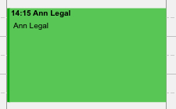

Selected:

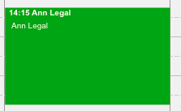

<a id="nummer_00083"></a>

### hmCal_prop_3LinesHeader (81)

This property defines, if three lines are shown in the header of the user multi day view and project view. Default are two lines.

Example of three lines:

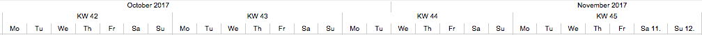

<a id="nummer_00084"></a>

### hmCal_prop_Barheight (82)

This property defines the barheight of all appointments. If barheight is 0 (which is the default value), the barheight will be calculated automatically.

<a id="nummer_00085"></a>

### hmCal_prop_TimelineDescrOffsetV (83)

With this property, you can set an offset for the time text of the time line. A negative values moves the text in the given pixels up and a positive value moves it down. Default is 0.

<a id="nummer_00086"></a>

### hmCal_prop_HeaderLineHeight1 (84)

This property defines the height of the first header line in pixels. Default value is 16.

<a id="nummer_00087"></a>

### hmCal_prop_HeaderLineHeight2 (85)

This property defines the height of the second header line in pixels. Default value is 16.

<a id="nummer_00088"></a>

### hmCal_prop_HeaderLineHeight3 (86)

This property defines the height of the third header line in pixels. Default value is 16.

<a id="nummer_00089"></a>

### hmCal_prop_DaylineFromHeader (87)

This property defines if the vertical day separator-line of the multi day view goes from the header (value=1, default) or from the calendar-area (value=0).

<a id="nummer_00090"></a>

### hmCal_prop_ScrollIncrementSeconds (88)

The property defines the scroll increment of the scrollbar (same for mouse wheel) per step. Default value is 1800 (seconds). This is for views only, where the scrolling is time-based. For pixel-based increment use *hmCal_prop_ScrollIncrementPixels*.

<a id="nummer_00091"></a>

### hmCal_prop_DescrTextInProjectView (89)

If this property is set to *1*, the description text of the appointment is shown next to the bar on the right side.

Example:

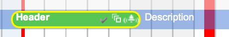

<a id="nummer_00092"></a>

### hmCal_prop_ScrollIncrementPixels (90)

The property defines the scroll increment of the scrollbar (same for mouse wheel) per step. Default value is 5 (pixels). This is for views only, where the scrolling is pixel-based. For time-based increment use *hmCal_prop_ScrollIncrementSeconds*.

<a id="nummer_00093"></a>

### hmCal_prop_IconsRight (91)

The property defines, if the icons should be displayed on the right side of the appointments. Default value is *0*.

<a id="nummer_00094"></a>

### hmCal_prop_BulletMonthView (92)

The property defines, if the bullet in front of each appointment is visible in month view. Default value is *1*.

<a id="nummer_00095"></a>

## Example

The following example get the width of the user list in the user week view and increases the value around 10 pixels:

```4d
C_LONGINT($vl_width)

$vl_width=hmCal_Get Area Property(hmCal;hmCal_prop_UserListWidth)

hmCal_SET AREA PROPERTY(hmCal;hmCal_prop_UserListWidth;$vl_width+10)
```
