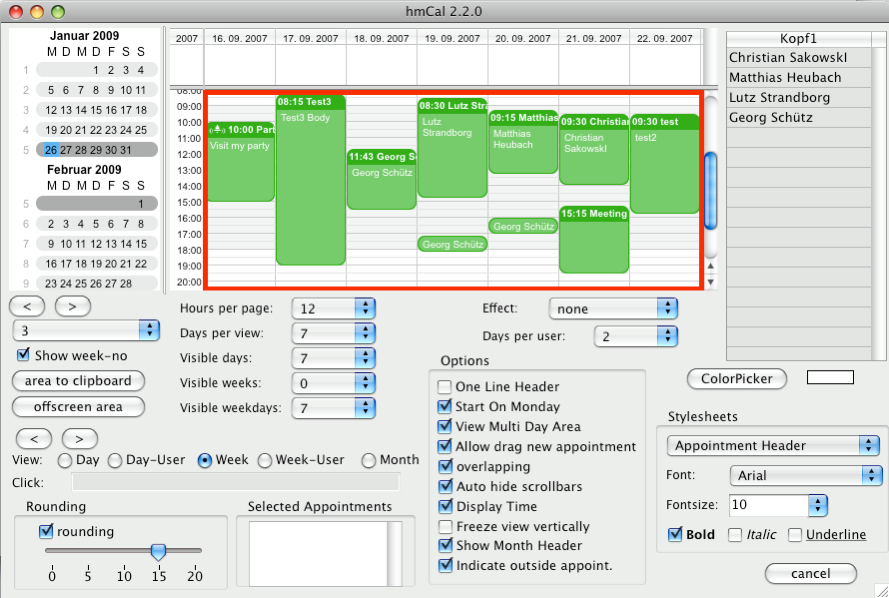
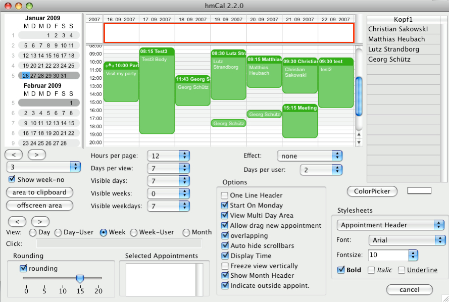
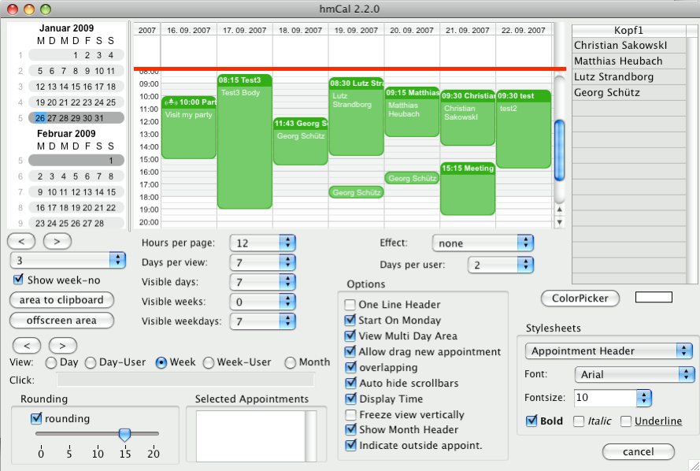
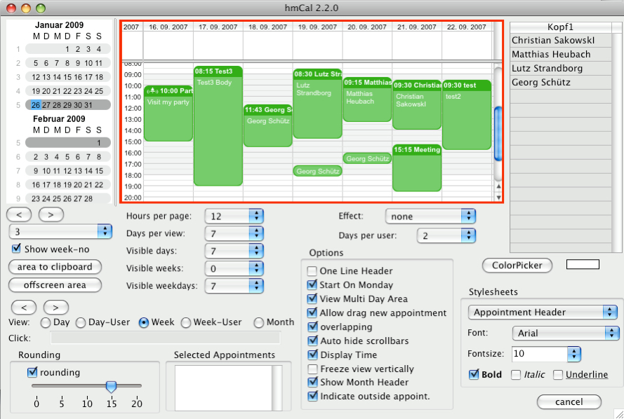
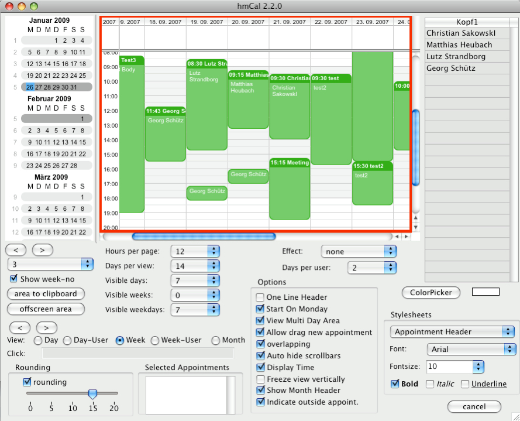
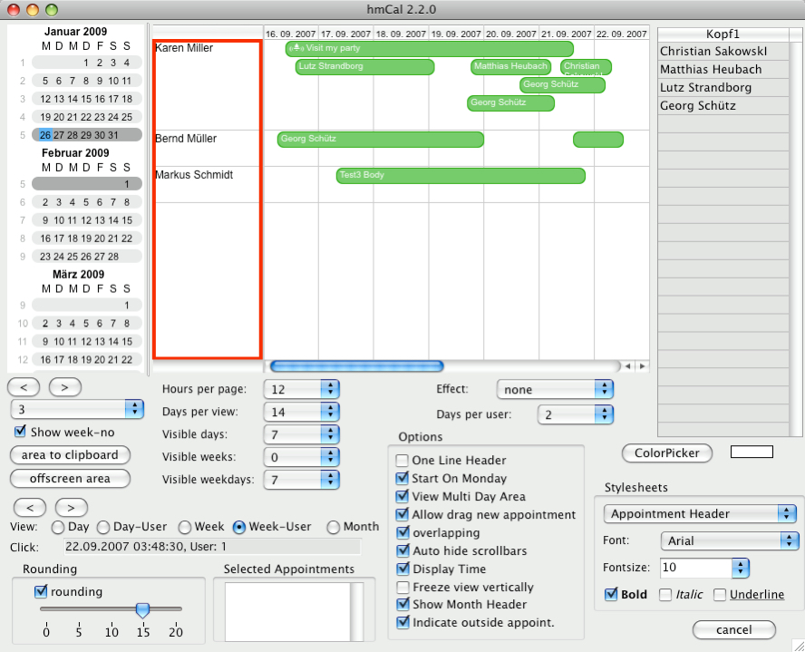
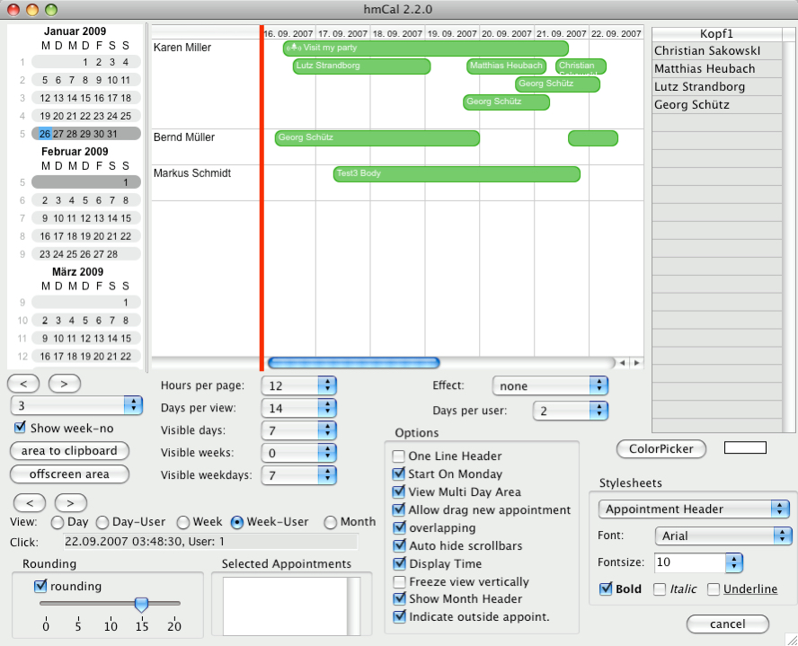
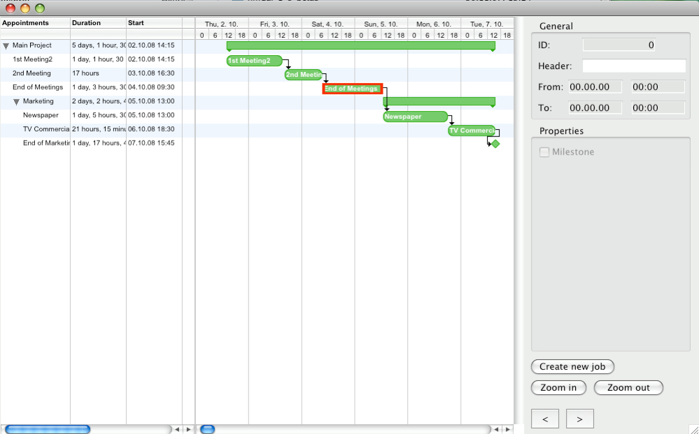
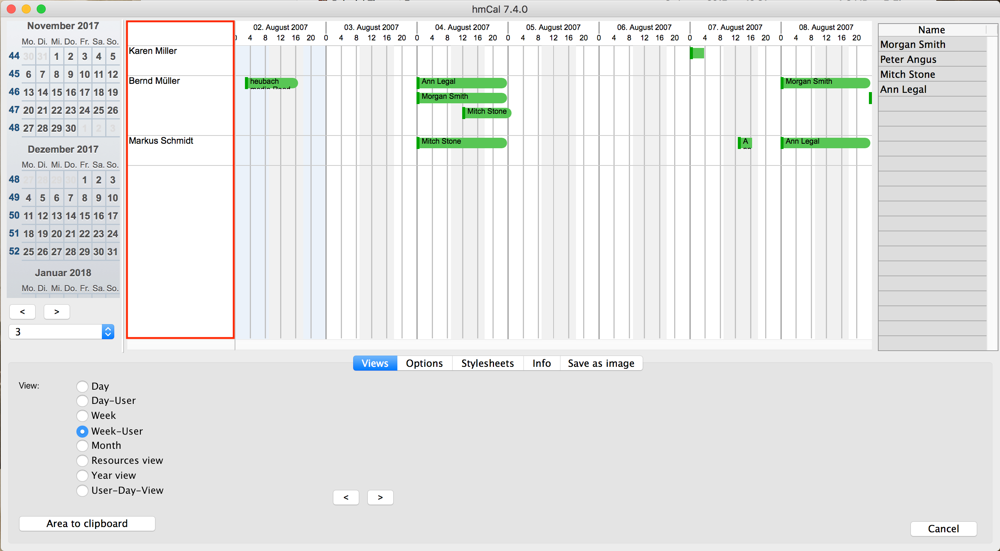
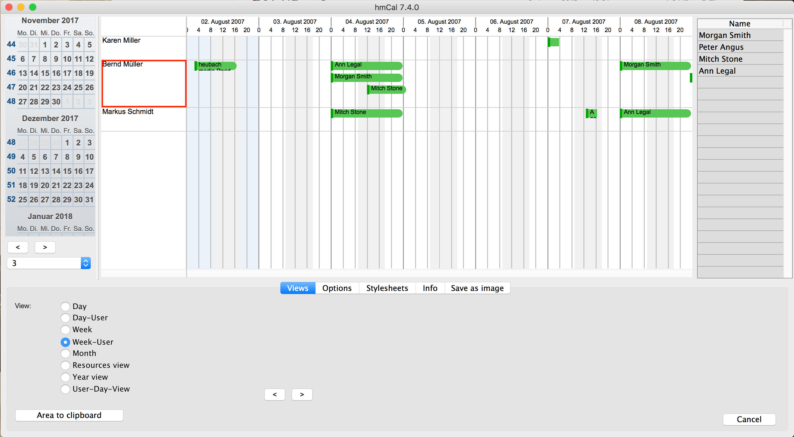

[Calendar Settings](../../guides/category-pages/calendar-settings.md)

# hmCal_GET OBJECT RECT

`hmCal_GET OBJECT RECT(area;type1;type2;type3;left;top;right;bottom)`

| Parameter | Type | Direction | Description |
| --- | --- | --- | --- |
| area | C_LONGINT | -> | hmCal area |
| type1 | C_LONGINT | -> | type 1 |
| type2 | C_LONGINT | -> | type 2 |
| type3 | C_LONGINT | -> | type 3 |
| left | C_REAL | <- | left coordinate |
| top | C_REAL | <- | top coordinate |
| right | C_REAL | <- | right coordinate |
| bottom | C_REAL | <- | bottom coordinate |

## Contents

- [1 Description](#nummer_00001)
- [2 Types](#nummer_00002)  [3 Example](#nummer_00014)
  - [2.1 1 (Inner calendar area)](#nummer_00003)
  - [2.2 2 (Multidayarea)](#nummer_00004)
  - [2.3 3 (Header)](#nummer_00005)
  - [2.4 4 (Multidaysplitter)](#nummer_00006)
  - [2.5 5 (Entire hmCal area)](#nummer_00007)
  - [2.6 6 (Entire inner area (without scrollbars))](#nummer_00008)
  - [2.7 7 (Listarea)](#nummer_00009)
  - [2.8 8 (vertical splitterarea)](#nummer_00010)
  - [2.9 9 (Appointment in the project view)](#nummer_00011)
  - [2.10 10 (Column in the user multi day view and project view)](#nummer_00012)
  - [2.11 11 (Cell in the user multi day view and project view)](#nummer_00013)

<a id="nummer_00001"></a>

## Description

The command ***hmCal_GET OBJECT RECT*** returns the coordinates of a specific area of the hmCal area in the current window. The values returned by the command are pixel coordinates. Following types are available:

<a id="nummer_00002"></a>

## Types

<a id="nummer_00003"></a>

### 1 (Inner calendar area)

*type2* and *type3* are *0*:



<a id="nummer_00004"></a>

### 2 (Multidayarea)

*type2* and *type3* are *0*:



<a id="nummer_00005"></a>

### 3 (Header)

*type2* and *type3* are *0*:


<a id="nummer_00006"></a>

### 4 (Multidaysplitter)

*type2* and *type3* are *0*:



<a id="nummer_00007"></a>

### 5 (Entire hmCal area)

*type2* and *type3* are *0*:



<a id="nummer_00008"></a>

### 6 (Entire inner area (without scrollbars))

*type2* and *type3* are *0*:



<a id="nummer_00009"></a>

### 7 (Listarea)

*type2* and *type3* are *0*:



<a id="nummer_00010"></a>

### 8 (vertical splitterarea)

*type2* and *type3* are *0*:



<a id="nummer_00011"></a>

### 9 (Appointment in the project view)

*type2* is the appointment reference and *type3* is *0*:



<a id="nummer_00012"></a>

### 10 (Column in the user multi day view and project view)

*type2* is the column ID, *type3* is *0*:



<a id="nummer_00013"></a>

### 11 (Cell in the user multi day view and project view)

*type2* is the column ID, *type3* is the user ID (user multi day view) or the appointment ID (project view):



<a id="nummer_00014"></a>

## Example

The following example returns the coordinates of the inner calendar area:

```4d
C_REAL($vz_left;$vz_top;$vz_right;$vz_bottom)

$vz_left:=0
$vz_top:=0
$vz_right:=0
$vz_bottom:=0

hmCal_GET OBJECT RECT (hmCal;1;0;0;$vz_left;$vz_top;$vz_right;$vz_bottom)
```
