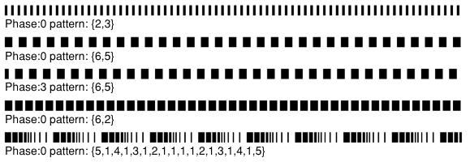
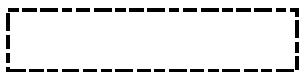

[Calendar Settings](../../guides/category-pages/calendar-settings.md)

# hmCal_SET LINEDASH

`hmCal_SET LINEDASH(area;selector;phase;arrayDashes)`

| Parameter | Type | Direction | Description |
| --- | --- | --- | --- |
| area | Longint | -> | hmCal area |
| selector | Longint | -> | line |
| phase | Real | -> | Phase to begin |
| arrayDashes | ARRAY REAL | -> | Dashes array |

<a id="nummer_00001"></a>

## Description

The command ***hmCal_SET LINEDASH*** sets the line dash pattern of a line. A line dash pattern allows you to draw a segmented line. You control the size and placement of dash segments along the line by specifying the dash array and the dash phase.

The *phase* parameter specifies the starting point of the dash pattern. The array *arrayDashes* specifies the widths of the dashes, alternating between the painted and unpainted segments of the line.

To reset the line to its default value, just set an empty array.

Examples of line dash patterns:



The following lines are supported:

- hmCal_clr_Hourline
- hmCal_clr_Halfhourline
- hmCal_clr_Dayline

<a id="nummer_00002"></a>

## Example

The following examples sets a special line:

```4d
 
ARRAY REAL($tz_dashes;6)
$tz_dashes{1}:=5
$tz_dashes{2}:=1
$tz_dashes{3}:=4
$tz_dashes{4}:=1
$tz_dashes{5}:=3
$tz_dashes{6}:=1

hmCal_SET LINEDASH (hmCal;$selector;0;$tz_dashes)
```

Result:


