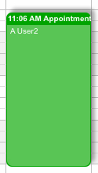

[Calendar Settings](../../guides/category-pages/calendar-settings.md)

# hmCal_SET SHADOW

`hmCal_SET SHADOW(area;h;v;blur)`

| Parameter | Type | Direction | Description |
| --- | --- | --- | --- |
| area | Longint | -> | hmCal Bereich |
| h | Longint | -> | horizontal offset |
| v | Longint | -> | vertical offset |
| blur | Longint | -> | blur |

<a id="nummer_00001"></a>

## Description

The command ***hmCal_SET SHADOW*** defines a shadow for all appointments. This command only works on Macintosh.

<a id="nummer_00002"></a>

## Example

The following example defines a shadow:

```4d
hmCal_SET SHADOW (calArea;5;5;5)
```

Result:


