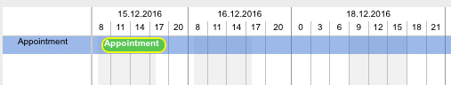

[Calendar Settings](../../guides/category-pages/calendar-settings.md)

# hmCal_SET TIMEOUT LIST

`hmCal_SET TIMEOUT LIST(area;date_from;time_from;date_to;time_to)`

```4d
Parameter          Type             Description
area               Longint      ->  hmCal area
date_from          ARRAY DATE   ->  Date from
time_from          ARRAY LONGINT->  Time from
date_to            ARRAY DATE   ->  Date to
time_to            ARRAY LONGINT->  Time to
```

<a id="nummer_00001"></a>

## Description

The command ***hmCal_SET TIMEOUT LIST*** sets time outs (time holes) in the current day range. The command only takes effect in the views *hmCal_UserMultiDayView* and *hmCal_ProjectView*.

The command overwrites all previous time outs.

The hidden times and dates can overlap each other.

You can hide complete days if you pass the same date in date_from and date_to with the times 00:00:00 to 23:59:59.

Currently it is only allowed to hide entire hours, because the headers may not looking good.

Currently time outs are only implemented in the scales (zooms) of **day/hours** and **week/days**.

<a id="nummer_00002"></a>

## Example

The following example sets four time outs:

- Hide the current date from 12 am to 8 am
- Hide the current date from 11 pm to 12 am
- Hide tomorrow from 12 am to 8 am
- Hide the complete next day after tomorrow

```4d
ARRAY DATE($td_arrayDateFrom;4)
ARRAY LONGINT($tl_arrayTimeFrom;4)
ARRAY DATE($td_arrayDateTo;4)
ARRAY LONGINT($tl_arrayTimeTo;4)

$td_arrayDateFrom{1}:=Current date
$tl_arrayTimeFrom{1}:=?00:00:00?
$td_arrayDateTo{1}:=Current date
$tl_arrayTimeTo{1}:=?07:59:59?

$td_arrayDateFrom{2}:=Current date
$tl_arrayTimeFrom{2}:=?23:00:00?
$td_arrayDateTo{2}:=Current date
$tl_arrayTimeTo{2}:=?23:59:59?

$td_arrayDateFrom{3}:=Current date+1
$tl_arrayTimeFrom{3}:=?00:00:00?
$td_arrayDateTo{3}:=Current date+1
$tl_arrayTimeTo{3}:=?07:59:59?

$td_arrayDateFrom{4}:=Current date+2
$tl_arrayTimeFrom{4}:=?00:00:00?
$td_arrayDateTo{4}:=Current date+2
$tl_arrayTimeTo{4}:=?23:59:59?

hmCal_SET TIMEOUT LIST ($vl_area;$td_arrayDateFrom;$tl_arrayTimeFrom;$td_arrayDateTo;$tl_arrayTimeTo)
```

The result looks like (if the current day was Dec 15, 2016):


