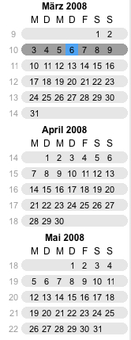
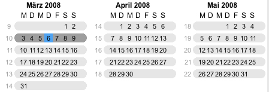

[Mini-Calendar](../../guides/category-pages/mini-calendar.md)

# hmCal_mini_SET ORIENTATION

`hmCal_mini_SET ORIENTATION(area;orientation)`

| Parameter | Type | Direction | Description |
| --- | --- | --- | --- |
| area | Longint | -> | hmCal-mini area |
| orientation | Longint | -> | 0=horizontal, 1=vertical |

## Contents

- [1 Description](#nummer_00001)  [2 Example](#nummer_00004)
  - [1.1 Vertical](#nummer_00002)
  - [1.2 Horizontal](#nummer_00003)

<a id="nummer_00001"></a>

## Description

The command ***hmCal_mini_SET ORIENTATION*** sets the orientation of the minicalendar to horizontal or vertical. The default setting is vertical.

<a id="nummer_00002"></a>

### Vertical



<a id="nummer_00003"></a>

### Horizontal



<a id="nummer_00004"></a>

## Example

The following example displays all months horizontally:

```4d
hmCal_mini_SET ORIENTATION(hmCalmini;0)
```
