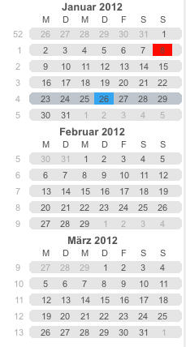
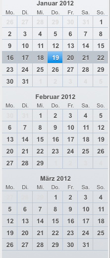

[Mini-Calendar](../../guides/category-pages/mini-calendar.md)

# hmCal_mini_SET STYLE

`hmCal_mini_SET STYLE(area;style)`

```
Parameter          Type             Description
area               Longint      ->  hmCal-mini area
style              Longint      ->  1=classic style
                                    2=modern style
```

<a id="nummer_00001"></a>

## Description

The command ***hmCal_mini_SET STYLE*** sets the style of the mini calendar. Two styles are currently supported:

Left: classic style (1) - constant: hmCal_mini_style_classic

Right: modern style (2) - constant: hmCal_mini_style_modern





Default is *hmCal_mini_style_modern*.

<a id="nummer_00002"></a>

## Example

The following example sets the style to "modern":

```4d
hmCal_mini_SET STYLE(hmCalmini;hmCal_mini_style_modern)
```
