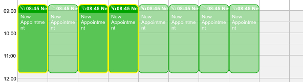

[Recurrence Appointments](../../guides/category-pages/recurrence-appointments.md)

# hmCal_GET SELECTED OCCURRENCES

`hmCal_GET SELECTED OCCURRENCES(area;appArray;recurArray)`

```
Parameter          Type             Description
area               Longint      ->  hmCal area
appArray           Array Longint<-  Array with selected
                                    appointments
recurArray         Array Longint<-  Array with
                                    recurrence numbers
```

## Contents

- [1 Description](#nummer_00001)
- [2 Example](#nummer_00002)
  - [2.1 Following code](#nummer_00003)
  - [2.2 Result](#nummer_00004)

<a id="nummer_00001"></a>

## Description

The command ***hmCal_GET SELECTED OCCURRENCES*** returns two arrays with selected appointments and their recurrence numbers for the area defined by *area*. The array *appArray* returns all selected appointments. If more than one recurrence was selected the id's in the array are not unique. The array *recurArray* returns an array with the same size of *appArray*. It contains the recurrence number for the appointment or *0* if the parent appointment was selected.

<a id="nummer_00002"></a>

## Example

The following appointments are selected



<a id="nummer_00003"></a>

### Following code

```4d
ARRAY LONGINT($tl_noApp;0)
ARRAY LONGINT($tl_noOcc;0)
hmCal_GET SELECTED OCCURRENCE (vl_hmCal;$tl_noApp;$tl_noOcc)
```

<a id="nummer_00004"></a>

### Result

```
$tl_noApp{1}=980
$tl_noApp{2}=980
$tl_noApp{3}=980

$tl_noOcc{1}=0
$tl_noOcc{2}=2
$tl_noOcc{3}=3
```
