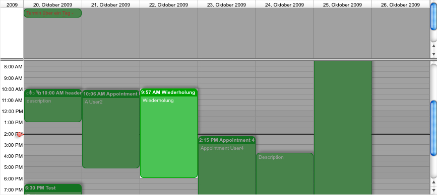

[Search](../../guides/category-pages/search.md)

# hmCal_SET TO SEARCH

`hmCal_SET TO SEARCH (area;appointmentID)`

| Parameter | Type | Direction | Description |
| --- | --- | --- | --- |
| area | Longint | -> | hmCal area |
| appointmentID | Longint | -> | Appointment reference |

<a id="nummer_00001"></a>

## Description

The command ***hmCal_SET TO SEARCH*** sets an appointment to the visual search. Pass an appointment reference as parameter *appointmentID*, which shall be highlighted in the current search mode.

<a id="nummer_00002"></a>

## Example

The following example sets the hmCal to the search mode and highlights an appointment:

```4d
hmCal_SET SEARCHMODE (calarea;1)
hmCal_SET TO SEARCH (calarea;3)
```


