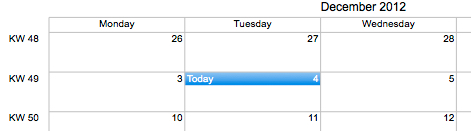

[Special days](../../guides/category-pages/special-days.md)

# hmCal_SET SPECIAL DAY NAME

`hmCal_SET SPECIAL DAY NAME(area;date;text)`

| Parameter | Type | Direction | Description |
| --- | --- | --- | --- |
| area | Longint | -> | hmCal area |
| date | Date | -> | Date |
| text | Text | -> | Description text |

<a id="nummer_00001"></a>

## Description

The command ***hmCal_SET SPECIAL DAY NAME*** sets a special description text for a day in the month view. This is helpful, if you want to highlight a holiday. You can set only one text per day. Pass in *date* a date to highlight and in *text* a description text for the day. If you pass an empty string in *text* the day will not be highlighted.

<a id="nummer_00002"></a>

## Example

The following example highlights the current date in the month view:

```4d
hmCal_SET SPECIAL DAY NAME (hmCal;Current date;"Today")
```

Result:


