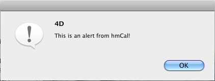

[System processes](../../guides/category-pages/system-processes.md)

# hmCal_DISPLAY NOTIFICATION

`hmCal_DISPLAY NOTIFICATION (Alerttext)`

| Parameter | Type | Direction | Description |
| --- | --- | --- | --- |
| Alerttext | Text | <- | Alert text |

<a id="nummer_00001"></a>

## Description

The command ***hmCal_DISPLAY NOTIFICATION*** shows an alert also if the current application is not in the front or is not visible.

On Macintosh you can show an alert even if you application is not shown:



Please use the 4D command **DISPLAY NOTIFICATION** on Windows!

<a id="nummer_00002"></a>

## Example

The following code shows an alert:

```4d
hmCal_DISPLAY NOTIFICATION ("This is an alert from hmCal!")
```
