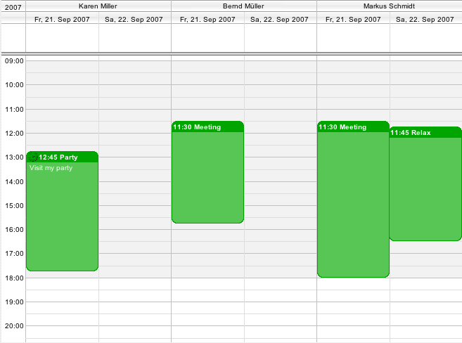

[User](../../guides/category-pages/user.md)

# hmCal_SET DAYS PER USER

`hmCal_SET DAYS PER USER(area;days)`

| Parameter | Type | Direction | Description |
| --- | --- | --- | --- |
| area | Longint | -> | hmCal area |
| days | Longint | -> | days |

<a id="nummer_00001"></a>

## Description

The command ***hmCal_SET DAYS PER USER*** definies, how many days have to been display for each user in the user day view.



Example with three users and two days of each.

<a id="nummer_00002"></a>

## Example

The following example shows in the user day view 3 users and 5 days of each user:

```4d
hmCal_SET USERS PER PAGE(hmCal;3)
hmCal_SET DAYS PER USER(hmCal;5)
```
