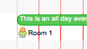

[User](../../guides/category-pages/user.md)

# hmCal_SET USER ICON

`hmCal_SET USER ICON(area;reference;icon)`

| Parameter | Type | Direction | Description |
| --- | --- | --- | --- |
| area | Longint | -> | hmCal area |
| reference | Longint | -> | user-id |
| icon | Longint | -> | icon-id |

<a id="nummer_00001"></a>

## Description

The command ***hmCal_SET USER ICON*** sets an icon for an user in the project view. The icon have to exists or you have to add this icon previously with the command [hmCal_Add Icon](../icons/hmCal_Add-Icon.md). Pass the icon reference into the parameter *icon*. Pass the user reference into the parameter *reference*.

This command sets the icon for the user only in the **project view**:



<a id="nummer_00002"></a>

## Example

The following example sets an icon with the reference 2 for the user with the reference 10:

```4d
hmCal_SET USER ICON (hmCal;10;2)
```
