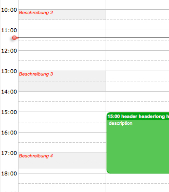

[Working Hours](../../guides/category-pages/working-hours.md)

# hmCal_SET WORKING HOURS PROP

`hmCal_SET WORKING HOURS PROP(area;workingHoursID;selector;valuedate;valueReal;valueText)`

| Parameter | Type | Direction | Description |
| --- | --- | --- | --- |
| area | Longint | -> | hmCal area |
| workingHoursID | Longint | -> | Working hours ID |
| selector | Longint | -> | Property type |
| valuedate | Date | -> | Date value |
| valueReal | Real | -> | Real value |
| valueText | Text | -> | Text value |

## Contents

- [1 Description](#nummer_00001)  [2 Example](#nummer_00003)
  - [1.1 hmCal_wprop_Name (1)](#nummer_00002)

## Description

The command ***hmCal_SET WORKING HOURS PROP*** sets several properties for a working hours record. You can create working hours records with the commands [hmCal_SET WORKING HOURS](hmCal_SET-WORKING-HOURS.md) and [hmCal_SET WORKING HOURS EX](hmCal_SET-WORKING-HOURS-EX.md).

You can get a list of all working hours with the command [hmCal_GET WORKING HOUR LIST](hmCal_GET-WORKING-HOUR-LIST.md).

List of possible properties to set/get:

### hmCal_wprop_Name (1)

Pass the name of the working hour in the parameter **valueText**.

## Example
