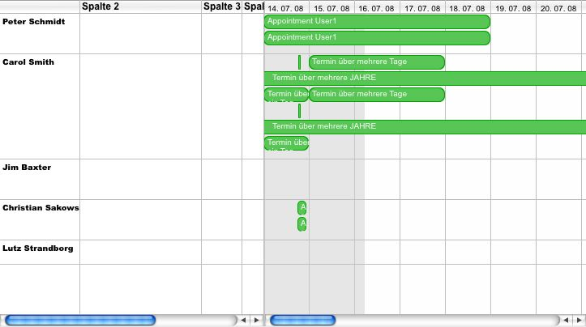

[Columns](../category-pages/columns.md)

# Columns

Columns are a new and important feature in hmCal 2.0

You can create user definied columns in the following views:

- user multi day view
- project view

This is very helpful, if you want to display more information about an appointment or an user.

You can create columns with the command [hmCal_Add Column](../../commands/columns/hmCal_Add-Column.md) and you can delete columns with the command [hmCal_Delete Column](../../commands/columns/hmCal_Delete-Column.md).

You can apply stylesheets to every single column. See chapter [hmCal_Apply Stylesheet](../../commands/stylesheets/hmCal_Apply-Stylesheet.md).

hmCal creates a standard columns with the id *-1*. This column you cannot delete or set values but you can apply a stylesheet to it.

Example for a column view of the user multi day view:

## Cells

You can set cell values with the command [hmCal_Set Column Cell Value](../../commands/columns/hmCal_Set-Column-Cell-Value.md). You can get cell values with the command [hmCal_Get Column Cell Value](../../commands/columns/hmCal_Get-Column-Cell-Value.md). To delete all values of a column, you can use the command [hmCal_Delete Column Values]].
