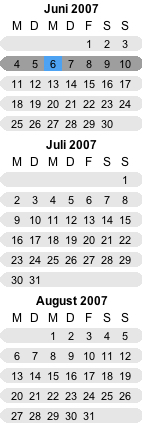

[Mini-Calendar](../category-pages/mini-calendar.md)

# Mini-calendar-introduction

The mini calendar offers the possibility of navigating the user fast between the months and days. This calendar is independent of the main calendar and can be used also for other purposes.

## Designs

Currently there are two different designs supported:

Left: classic style

Right: modern style

You can switch between the styles with the command [hmCal_mini_SET STYLE](../../commands/mini-calendar/hmCal_mini_SET-STYLE.md).

There are some limitations about the modern style:

- Special days are not displayed ([hmCal_mini_ADD SPECIAL DAY](../../commands/mini-calendar/hmCal_mini_ADD-SPECIAL-DAY.md))
- No display of the week number ([hmCal_mini_DISPLAY WEEK NUMBER](../../commands/mini-calendar/hmCal_mini_DISPLAY-WEEK-NUMBER.md))
- No horizontal orientation ([hmCal_mini_SET ORIENTATION](../../commands/mini-calendar/hmCal_mini_SET-ORIENTATION.md))
