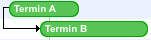
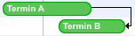

[Relations](../category-pages/relations.md)

# Relations

Relations are a feature to create relations between two appointments. These relations are displayed only in the project view.

The following releation types are supported by hmCal:

## Contents

- [1 1 End to begin (hmCal_rel_EndToBegin)](#nummer_00001)
- [2 2 Begin to begin (hmCal_rel_BeginToBegin)](#nummer_00002)
- [3 3 End to end (hmCal_rel_EndToEnd)](#nummer_00003)
- [4 4 Begin to end (hmCal_rel_BeginToEnd)](#nummer_00004)

## 1 End to begin (hmCal_rel_EndToBegin)

Appointment B can start only, if appointment A has finished.

## 2 Begin to begin (hmCal_rel_BeginToBegin)

Appointment B can start only, if appointment A has already started. Appointment B can start every time after appointment A has started. For this begin to begin relation, both appointments must not start at the same time.

## 3 End to end (hmCal_rel_EndToEnd)

Appointment B can finish only, if appointment A has finished. Appointment B can finish every time after appointment A has finished. For this end to end relation, both appointments must not end at the same time.

## 4 Begin to end (hmCal_rel_BeginToEnd)

Appointment B can finish only, if appointment A has started. Appointment B can finish every time, after appointment A has started. For this begin to end relation, appointment A and B must not end at the same time.

